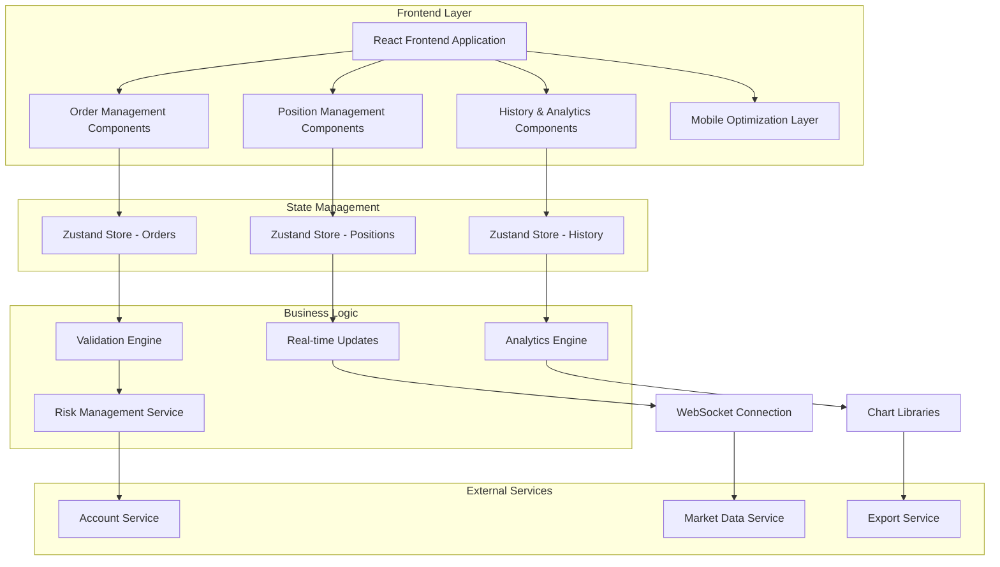
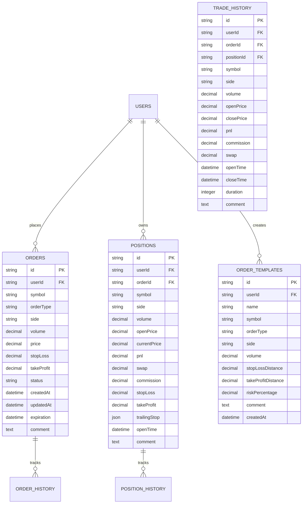

# Advanced Order Management System - Technical Architecture Document

## 1. Architecture Design



## 2. Technology Description

* **Frontend**: React\@18 + TypeScript\@5 + Tailwind CSS\@3 + Vite\@5

* **State Management**: Zustand\@4 for global state management

* **UI Components**: Radix UI primitives + Custom components

* **Charts & Analytics**: Recharts\@2 for trade analysis visualization

* **Form Management**: React Hook Form\@7 + Zod\@3 for validation

* **Date Handling**: date-fns\@3 for date manipulation and formatting

* **Icons**: Lucide React\@0.400+ for consistent iconography

* **Gestures**: React Use Gesture\@10 for mobile touch interactions

* **Export**: Papa Parse\@5 for CSV export functionality

* **Notifications**: React Hot Toast\@2 for user feedback

## 3. Route Definitions

| Route              | Purpose                                                 |
| ------------------ | ------------------------------------------------------- |
| /trading           | Main trading interface with integrated order management |
| /trading/orders    | Dedicated order management dashboard                    |
| /trading/positions | Enhanced position management interface                  |
| /trading/history   | Trade history and analytics dashboard                   |
| /trading/templates | Order template management                               |
| /mobile/trading    | Mobile-optimized trading interface                      |

## 4. API Definitions

### 4.1 Core API Endpoints

**Order Management**

```typescript
POST /api/orders
```

Request:

| Param Name | Param Type | isRequired | Description                              |
| ---------- | ---------- | ---------- | ---------------------------------------- |
| symbol     | string     | true       | Trading pair symbol (e.g., "EURUSD")     |
| orderType  | OrderType  | true       | Type of order (MARKET, LIMIT, STOP, OCO) |
| side       | OrderSide  | true       | BUY or SELL                              |
| volume     | number     | true       | Position size in lots                    |
| price      | number     | false      | Entry price for limit/stop orders        |
| stopLoss   | number     | false      | Stop loss price                          |
| takeProfit | number     | false      | Take profit price                        |
| expiration | Date       | false      | Order expiration time                    |

Response:

| Param Name       | Param Type         | Description                      |
| ---------------- | ------------------ | -------------------------------- |
| success          | boolean            | Order placement status           |
| orderId          | string             | Unique order identifier          |
| message          | string             | Success or error message         |
| validationErrors | ValidationError\[] | Field-specific validation errors |

**Position Management**

```typescript
GET /api/positions
PUT /api/positions/:id
DELETE /api/positions/:id
POST /api/positions/bulk-close
```

**Trade History**

```typescript
GET /api/trades/history
```

Request:

| Param Name | Param Type | isRequired | Description                  |
| ---------- | ---------- | ---------- | ---------------------------- |
| page       | number     | false      | Page number for pagination   |
| limit      | number     | false      | Items per page (default: 50) |
| symbol     | string     | false      | Filter by trading pair       |
| dateFrom   | string     | false      | Start date (ISO format)      |
| dateTo     | string     | false      | End date (ISO format)        |
| orderType  | OrderType  | false      | Filter by order type         |

### 4.2 TypeScript Interface Definitions

```typescript
// Core Order Types
export interface Order {
  id: string;
  symbol: string;
  orderType: OrderType;
  side: OrderSide;
  volume: number;
  price?: number;
  stopLoss?: number;
  takeProfit?: number;
  status: OrderStatus;
  createdAt: Date;
  updatedAt: Date;
  expiration?: Date;
  comment?: string;
}

export type OrderType = 'MARKET' | 'LIMIT' | 'STOP' | 'STOP_LIMIT' | 'OCO';
export type OrderSide = 'BUY' | 'SELL';
export type OrderStatus = 'PENDING' | 'FILLED' | 'CANCELLED' | 'REJECTED' | 'EXPIRED';

// Position Management
export interface Position {
  id: string;
  symbol: string;
  side: OrderSide;
  volume: number;
  openPrice: number;
  currentPrice: number;
  pnl: number;
  pnlPercent: number;
  swap: number;
  commission: number;
  stopLoss?: number;
  takeProfit?: number;
  trailingStop?: TrailingStop;
  openTime: Date;
  comment?: string;
}

export interface TrailingStop {
  enabled: boolean;
  distance: number;
  step: number;
  currentLevel?: number;
}

// Order Form Validation
export interface OrderFormData {
  symbol: string;
  orderType: OrderType;
  side: OrderSide;
  volume: number;
  price?: number;
  stopLoss?: number;
  takeProfit?: number;
  riskPercentage?: number;
  expiration?: Date;
  comment?: string;
}

export interface ValidationError {
  field: string;
  message: string;
  code: string;
}

export interface OrderValidationResult {
  isValid: boolean;
  errors: ValidationError[];
  warnings: string[];
  marginRequired: number;
  riskAmount: number;
}

// Risk Management
export interface RiskCalculation {
  positionSize: number;
  riskAmount: number;
  riskPercentage: number;
  marginRequired: number;
  leverageUsed: number;
  potentialProfit: number;
  potentialLoss: number;
  riskRewardRatio: number;
}

// Trade History & Analytics
export interface TradeHistory {
  id: string;
  orderId: string;
  symbol: string;
  side: OrderSide;
  volume: number;
  openPrice: number;
  closePrice: number;
  pnl: number;
  commission: number;
  swap: number;
  openTime: Date;
  closeTime: Date;
  duration: number;
  comment?: string;
}

export interface PerformanceMetrics {
  totalTrades: number;
  winningTrades: number;
  losingTrades: number;
  winRate: number;
  totalPnL: number;
  averageWin: number;
  averageLoss: number;
  largestWin: number;
  largestLoss: number;
  profitFactor: number;
  sharpeRatio: number;
  maxDrawdown: number;
  recoveryFactor: number;
}

// Order Templates
export interface OrderTemplate {
  id: string;
  name: string;
  symbol: string;
  orderType: OrderType;
  side: OrderSide;
  volume: number;
  stopLossDistance?: number;
  takeProfitDistance?: number;
  riskPercentage?: number;
  comment?: string;
  createdAt: Date;
}

// Mobile Gesture Types
export interface SwipeAction {
  direction: 'left' | 'right' | 'up' | 'down';
  action: 'close' | 'modify' | 'details' | 'cancel';
  threshold: number;
}

export interface TouchGesture {
  type: 'tap' | 'long-press' | 'swipe' | 'pinch';
  target: string;
  callback: () => void;
}
```

## 5. Component Architecture

### 5.1 Component Hierarchy

```
AdvancedOrderManagement/
├── OrderForms/
│   ├── DynamicOrderForm.tsx
│   ├── OrderTypeSelector.tsx
│   ├── PositionCalculator.tsx
│   ├── OrderValidation.tsx
│   └── OrderTemplates.tsx
├── PositionManagement/
│   ├── EnhancedPositionTable.tsx
│   ├── PositionRow.tsx
│   ├── BulkActions.tsx
│   ├── PositionModificationModal.tsx
│   └── TrailingStopManager.tsx
├── OrderHistory/
│   ├── TradeHistoryTable.tsx
│   ├── HistoryFilters.tsx
│   ├── PerformanceAnalytics.tsx
│   ├── TradeAnalysisCharts.tsx
│   └── ExportManager.tsx
├── Mobile/
│   ├── MobileOrderForm.tsx
│   ├── SwipeablePositionCard.tsx
│   ├── GestureHandler.tsx
│   └── TouchOptimizedTable.tsx
└── Shared/
    ├── RiskCalculator.tsx
    ├── ValidationDisplay.tsx
    ├── LoadingStates.tsx
    └── ErrorBoundary.tsx
```

### 5.2 State Management Structure

```typescript
// Order Management Store
export interface OrderStore {
  // State
  orders: Order[];
  activeOrder: OrderFormData | null;
  templates: OrderTemplate[];
  validationResult: OrderValidationResult | null;
  isSubmitting: boolean;
  
  // Actions
  setActiveOrder: (order: OrderFormData) => void;
  validateOrder: (order: OrderFormData) => Promise<OrderValidationResult>;
  submitOrder: (order: OrderFormData) => Promise<void>;
  saveTemplate: (template: Omit<OrderTemplate, 'id' | 'createdAt'>) => void;
  loadTemplates: () => Promise<void>;
}

// Position Management Store
export interface PositionStore {
  // State
  positions: Position[];
  selectedPositions: string[];
  sortConfig: SortConfig;
  filters: PositionFilters;
  
  // Actions
  loadPositions: () => Promise<void>;
  updatePosition: (id: string, updates: Partial<Position>) => Promise<void>;
  closePosition: (id: string) => Promise<void>;
  bulkClosePositions: (ids: string[]) => Promise<void>;
  setTrailingStop: (id: string, trailingStop: TrailingStop) => Promise<void>;
  exportPositions: (format: 'csv' | 'excel') => Promise<void>;
}

// History & Analytics Store
export interface HistoryStore {
  // State
  trades: TradeHistory[];
  metrics: PerformanceMetrics | null;
  filters: HistoryFilters;
  pagination: PaginationState;
  
  // Actions
  loadTradeHistory: (filters?: HistoryFilters) => Promise<void>;
  calculateMetrics: (trades: TradeHistory[]) => PerformanceMetrics;
  exportHistory: (format: 'csv' | 'excel', filters?: HistoryFilters) => Promise<void>;
}
```

## 6. Data Model

### 6.1 Database Schema (if applicable)



### 6.2 Local Storage Schema

```typescript
// Local Storage Keys
export const STORAGE_KEYS = {
  ORDER_TEMPLATES: 'trading_order_templates',
  USER_PREFERENCES: 'trading_user_preferences',
  TABLE_SETTINGS: 'trading_table_settings',
  MOBILE_SETTINGS: 'trading_mobile_settings'
} as const;

// Stored Data Structures
export interface StoredUserPreferences {
  defaultRiskPercentage: number;
  defaultOrderType: OrderType;
  autoCalculatePositionSize: boolean;
  showAdvancedOptions: boolean;
  mobileGesturesEnabled: boolean;
  notificationsEnabled: boolean;
}

export interface StoredTableSettings {
  sortColumn: string;
  sortDirection: 'asc' | 'desc';
  visibleColumns: string[];
  pageSize: number;
  filters: Record<string, any>;
}
```

## 7. Error Handling Strategy

### 7.1 Error Types

```typescript
export class OrderValidationError extends Error {
  constructor(
    public field: string,
    public code: string,
    message: string
  ) {
    super(message);
    this.name = 'OrderValidationError';
  }
}

export class InsufficientBalanceError extends Error {
  constructor(
    public required: number,
    public available: number
  ) {
    super(`Insufficient balance. Required: ${required}, Available: ${available}`);
    this.name = 'InsufficientBalanceError';
  }
}

export class MarketClosedError extends Error {
  constructor(public symbol: string) {
    super(`Market is closed for ${symbol}`);
    this.name = 'MarketClosedError';
  }
}
```

### 7.2 Error Handling Patterns

```typescript
// Global Error Handler
export const handleTradingError = (error: Error): void => {
  if (error instanceof OrderValidationError) {
    toast.error(`Validation Error: ${error.message}`);
  } else if (error instanceof InsufficientBalanceError) {
    toast.error('Insufficient account balance');
  } else if (error instanceof MarketClosedError) {
    toast.warning(`Market closed for ${error.symbol}`);
  } else {
    toast.error('An unexpected error occurred');
    console.error('Trading Error:', error);
  }
};

// Async Error Wrapper
export const withErrorHandling = <T extends any[], R>(
  fn: (...args: T) => Promise<R>
) => {
  return async (...args: T): Promise<R | null> => {
    try {
      return await fn(...args);
    } catch (error) {
      handleTradingError(error as Error);
      return null;
    }
  };
};
```

## 8. Performance Optimization

### 8.1 Optimization Strategies

* **Virtual Scrolling**: For large position tables and trade history

* **Debounced Validation**: Real-time form validation with 300ms debounce

* **Memoization**: React.memo for expensive calculations and renders

* **Lazy Loading**: Code splitting for mobile components

* **WebSocket Optimization**: Throttled updates for real-time data

* **Local Caching**: Cache frequently accessed data in Zustand stores

### 8.2 Mobile Performance

* **Touch Optimization**: Passive event listeners for better scroll performance

* **Gesture Debouncing**: Prevent accidental multiple actions

* **Reduced Animations**: Simplified animations for lower-end devices

* **Efficient Rendering**: Use React.memo and useMemo for mobile components

* **Bundle Splitting**: Separate mobile-specific code bundles

## 9. Testing Strategy

### 9.1 Unit Testing

* **Components**: Test rendering, user interactions, and prop handling

* **Stores**: Test state mutations and async actions

* **Utilities**: Test calculation functions and validation logic

* **Hooks**: Test custom hooks with React Testing Library

### 9.2 Integration Testing

* **Order Flow**: End-to-end order placement and validation

* **Position Management**: Test position modifications and bulk actions

* **Mobile Gestures**: Test touch interactions and swipe actions

* **Export Functions**: Test CSV/Excel export functionality

### 9.3 Performance Testing

* **Large Datasets**: Test with 1000+ positions and trade history

* **Mobile Performance**: Test on various device specifications

* **Memory Usage**: Monitor for memory leaks in long-running sessions

* **Network Conditions**: Test with slow/intermittent connections

