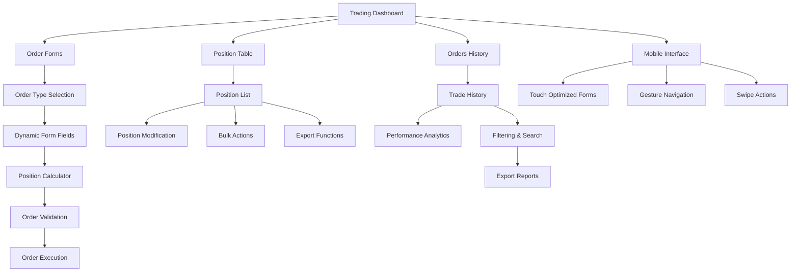

# Advanced Order Management System - Product Requirements Document

## 1. Product Overview

The Advanced Order Management System is a comprehensive trading interface that provides sophisticated order placement, validation, position management, and trade history functionality for forex trading platforms. It enhances the existing trading system with advanced features including dynamic order forms, real-time validation, position analytics, and mobile-optimized interfaces.

* **Primary Purpose**: Enable professional-grade order management with advanced validation, risk management, and position tracking capabilities

* **Target Users**: Active forex traders, professional traders, and trading platform users who require sophisticated order management tools

* **Market Value**: Provides institutional-level trading capabilities in a user-friendly interface, reducing trading errors and improving execution efficiency

## 2. Core Features

### 2.1 User Roles

| Role      | Registration Method       | Core Permissions                                                              |
| --------- | ------------------------- | ----------------------------------------------------------------------------- |
| Trader    | Platform account login    | Can place orders, manage positions, view history, access all trading features |
| Demo User | Demo account registration | Limited to demo trading with virtual funds, full feature access               |
| Admin     | Administrative access     | Can view all user positions, manage system settings, access analytics         |

### 2.2 Feature Module

Our advanced order management system consists of the following main components:

1. **Dynamic Order Forms**: Adaptive order entry interface with type-specific fields, real-time validation, and position calculators
2. **Order Validation Engine**: Comprehensive pre-trade checks including balance verification, margin calculations, and risk limits
3. **Enhanced Position Table**: Advanced position management with sorting, filtering, bulk actions, and modification capabilities
4. **Orders History Dashboard**: Complete trade history with analytics, filtering, performance metrics, and export functionality
5. **Mobile Trading Interface**: Touch-optimized interface with gesture controls and simplified workflows
6. **Risk Management Tools**: Position size calculators, risk percentage tools, and automated risk controls

### 2.3 Page Details

| Page Name        | Module Name           | Feature Description                                                                                                                                                                                                                        |
| ---------------- | --------------------- | ------------------------------------------------------------------------------------------------------------------------------------------------------------------------------------------------------------------------------------------ |
| Order Forms      | Dynamic Order Entry   | Create adaptive forms based on order type (Market, Limit, Stop, OCO). Include real-time field validation, position size calculator with risk percentage input, auto-fill from chart selections, and saved order templates for quick access |
| Order Forms      | Validation Engine     | Implement pre-order validation including account balance checks, stop loss/take profit level validation, margin requirement calculations, maximum position size enforcement, and duplicate order prevention                                |
| Position Table   | Position Management   | Display sortable columns (Symbol, Size, P\&L, Time, Type). Provide bulk actions (Close All, Close Profitable, Close by Symbol). Include position modification modal with trailing stop functionality and CSV export capability             |
| Position Table   | Position Analytics    | Calculate real-time P\&L, unrealized gains/losses, position performance metrics, and risk exposure analysis with visual indicators                                                                                                         |
| Orders History   | Trade History         | Implement paginated trade history with advanced filtering (date range, symbol, order type, status). Include search functionality and customizable date ranges                                                                              |
| Orders History   | Performance Analytics | Calculate performance metrics (win rate, average profit/loss, Sharpe ratio, maximum drawdown). Display trade analysis charts and provide detailed trade statistics                                                                         |
| Orders History   | Export Functions      | Enable CSV/Excel export of trade history, performance reports, and custom date range exports with filtering options                                                                                                                        |
| Mobile Interface | Touch Optimization    | Implement swipe actions for quick position closing, simplified order forms for mobile screens, touch-friendly buttons with proper spacing, and responsive table design                                                                     |
| Mobile Interface | Gesture Navigation    | Add gesture-based navigation, pull-to-refresh functionality, and mobile-specific shortcuts for common trading actions                                                                                                                      |
| Risk Management  | Position Calculator   | Provide position size calculator based on account balance and risk percentage, margin requirement calculator, and risk/reward ratio analysis                                                                                               |
| Risk Management  | Risk Controls         | Implement maximum position size limits, daily loss limits, and automated risk warnings with customizable thresholds                                                                                                                        |

## 3. Core Process

### Main Trading Flow

**Order Placement Process:**

1. User selects order type from dynamic form
2. System displays relevant fields based on order type
3. User enters trade parameters (symbol, size, price levels)
4. Position calculator shows risk metrics in real-time
5. System validates order against account balance and limits
6. User confirms order placement
7. Order is executed and position appears in position table

**Position Management Process:**

1. User views active positions in sortable table
2. User can modify positions through modal interface
3. Bulk actions available for multiple position management
4. Real-time P\&L updates with visual indicators
5. Trailing stops can be set and managed
6. Positions can be exported for analysis

**History Analysis Process:**

1. User accesses trade history with filtering options
2. System displays paginated results with search capability
3. Performance metrics calculated and displayed
4. Trade analysis charts show performance trends
5. Export functionality for detailed analysis

## 4. User Interface Design

### 4.1 Design Style

* **Primary Colors**: Dark theme with blue (#3B82F6) primary, green (#10B981) for profits, red (#EF4444) for losses

* **Secondary Colors**: Gray scale (#1F2937, #374151, #6B7280) for backgrounds and borders

* **Button Style**: Rounded corners (8px), gradient backgrounds, hover effects with smooth transitions

* **Typography**: Inter font family, 14px base size, bold weights for important data, proper hierarchy

* **Layout Style**: Card-based design with subtle shadows, responsive grid layouts, clean spacing

* **Icons**: Lucide React icons for consistency, 16px-20px sizes, contextual colors

* **Animations**: Smooth transitions (200ms), loading states, hover effects, and micro-interactions

### 4.2 Page Design Overview

| Page Name        | Module Name         | UI Elements                                                                                                                                                                               |
| ---------------- | ------------------- | ----------------------------------------------------------------------------------------------------------------------------------------------------------------------------------------- |
| Order Forms      | Dynamic Form        | Tabbed interface for order types, floating labels, real-time validation messages in red/green, position calculator sidebar with risk metrics, template dropdown with saved configurations |
| Order Forms      | Validation Display  | Toast notifications for validation errors, inline field validation with icons, progress indicators for order processing, confirmation modals with order summary                           |
| Position Table   | Table Interface     | Sortable column headers with arrows, color-coded P\&L cells (green/red), action buttons with icons, bulk selection checkboxes, responsive card layout for mobile                          |
| Position Table   | Modification Modal  | Overlay modal with form fields, slider controls for trailing stops, real-time P\&L preview, save/cancel buttons with loading states                                                       |
| Orders History   | History Table       | Paginated table with navigation controls, advanced filter sidebar, date range picker, search input with debounced results, export button with dropdown options                            |
| Orders History   | Analytics Dashboard | Chart components using recharts library, metric cards with trend indicators, performance summary cards, responsive grid layout                                                            |
| Mobile Interface | Touch Interface     | Large touch targets (44px minimum), swipe gesture indicators, simplified navigation tabs, pull-to-refresh animation, bottom sheet modals                                                  |

### 4.3 Responsiveness

The system is designed mobile-first with adaptive layouts:

* **Desktop**: Full table views with all columns, sidebar layouts, hover interactions

* **Tablet**: Condensed table views, collapsible sidebars, touch-friendly controls

* **Mobile**: Card-based layouts, bottom sheets, swipe gestures, simplified forms

* **Touch Optimization**: Minimum 44px touch targets, gesture support, haptic feedback where available

