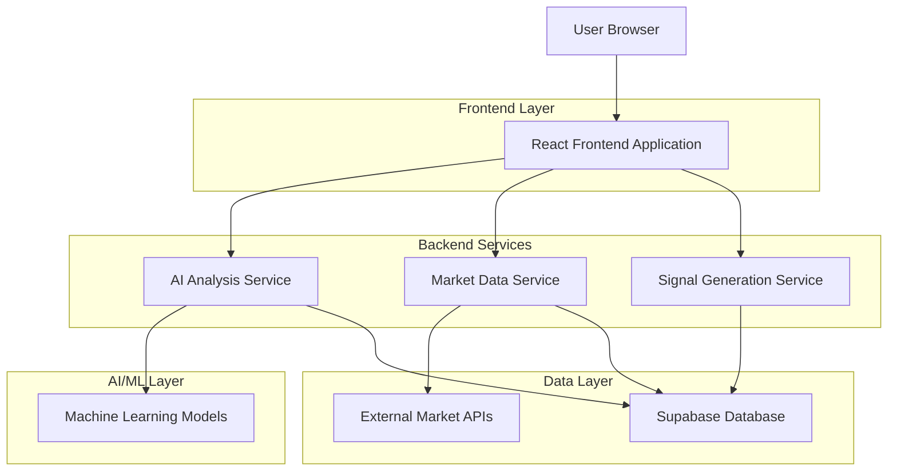
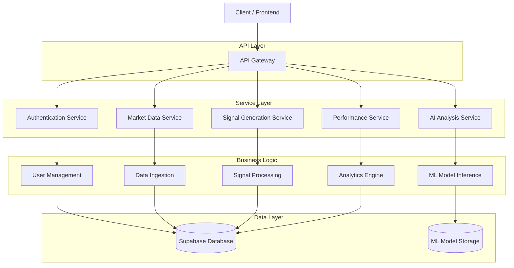
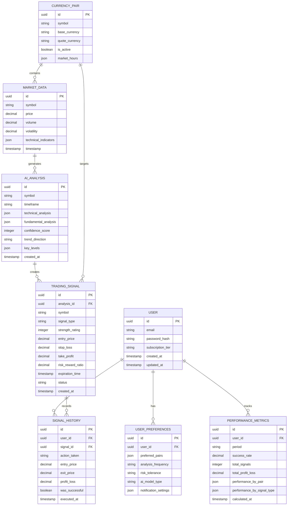

# AI-Powered Market Analysis Dashboard - Technical Architecture

## 1. Architecture Design



## 2. Technology Description

* Frontend: React\@18 + TypeScript + Tailwind CSS + Vite

* Backend: Node.js + Express\@4 + TypeScript

* Database: Supabase (PostgreSQL)

* AI/ML: Python + TensorFlow/PyTorch + FastAPI

* Data Visualization: Chart.js + D3.js + Recharts

* Real-time: WebSocket + Server-Sent Events

* External APIs: Alpha Vantage, Twelve Data, News API

## 3. Route Definitions

| Route        | Purpose                                     |
| ------------ | ------------------------------------------- |
| /dashboard   | Main dashboard with market analysis hub     |
| /analysis    | Detailed AI analysis cards and insights     |
| /signals     | Signal generation center and active signals |
| /insights    | Market insights panel and daily commentary  |
| /performance | Performance analytics and historical data   |
| /settings    | Customization settings and preferences      |
| /login       | User authentication and login               |
| /register    | User registration and account setup         |

## 4. API Definitions

### 4.1 Core API

**Market Analysis APIs**

```
GET /api/market/overview
```

Response:

| Param Name | Param Type | Description                                   |
| ---------- | ---------- | --------------------------------------------- |
| trends     | object\[]  | Market trend data with direction and strength |
| sentiment  | object     | Overall market sentiment with confidence      |
| volatility | number     | Current volatility index (0-100)              |
| keyLevels  | object\[]  | Support and resistance levels                 |

**AI Analysis APIs**

```
POST /api/ai/analyze
```

Request:

| Param Name   | Param Type | isRequired | Description                                     |
| ------------ | ---------- | ---------- | ----------------------------------------------- |
| symbol       | string     | true       | Currency pair symbol (e.g., EURUSD)             |
| timeframe    | string     | true       | Analysis timeframe (1h, 4h, 1d)                 |
| analysisType | string     | true       | Type of analysis (technical, fundamental, both) |

Response:

| Param Name          | Param Type | Description                             |
| ------------------- | ---------- | --------------------------------------- |
| technicalAnalysis   | object     | Technical indicators and trend analysis |
| fundamentalAnalysis | object     | Economic and news sentiment analysis    |
| confidence          | number     | AI confidence level (0-100)             |
| timestamp           | string     | Analysis generation timestamp           |

**Signal Generation APIs**

```
GET /api/signals/active
```

Response:

| Param Name | Param Type | Description                         |
| ---------- | ---------- | ----------------------------------- |
| signals    | object\[]  | Active trading signals with details |
| strength   | number     | Signal strength (1-5 stars)         |
| entry      | number     | Recommended entry price             |
| stopLoss   | number     | Stop loss level                     |
| takeProfit | number     | Take profit level                   |
| riskReward | number     | Risk/reward ratio                   |
| expiration | string     | Signal expiration time              |

**Performance Tracking APIs**

```
GET /api/performance/history
```

Request:

| Param Name | Param Type | isRequired | Description                  |
| ---------- | ---------- | ---------- | ---------------------------- |
| period     | string     | false      | Time period (1w, 1m, 3m, 1y) |
| signalType | string     | false      | Filter by signal type        |

Response:

| Param Name     | Param Type | Description                     |
| -------------- | ---------- | ------------------------------- |
| successRate    | number     | Overall success rate percentage |
| totalSignals   | number     | Total number of signals         |
| profitLoss     | number     | Total profit/loss               |
| bestPerforming | object\[]  | Best performing signal types    |

## 5. Server Architecture Diagram



## 6. Data Model

### 6.1 Data Model Definition



### 6.2 Data Definition Language

**Users Table**

```sql
-- Create users table
CREATE TABLE users (
    id UUID PRIMARY KEY DEFAULT gen_random_uuid(),
    email VARCHAR(255) UNIQUE NOT NULL,
    password_hash VARCHAR(255) NOT NULL,
    subscription_tier VARCHAR(20) DEFAULT 'basic' CHECK (subscription_tier IN ('basic', 'premium', 'professional')),
    created_at TIMESTAMP WITH TIME ZONE DEFAULT NOW(),
    updated_at TIMESTAMP WITH TIME ZONE DEFAULT NOW()
);

-- Create user preferences table
CREATE TABLE user_preferences (
    id UUID PRIMARY KEY DEFAULT gen_random_uuid(),
    user_id UUID REFERENCES users(id) ON DELETE CASCADE,
    preferred_pairs JSONB DEFAULT '[]',
    analysis_frequency VARCHAR(20) DEFAULT 'hourly' CHECK (analysis_frequency IN ('realtime', 'hourly', 'daily')),
    risk_tolerance VARCHAR(20) DEFAULT 'medium' CHECK (risk_tolerance IN ('low', 'medium', 'high')),
    ai_model_type VARCHAR(20) DEFAULT 'balanced' CHECK (ai_model_type IN ('conservative', 'balanced', 'aggressive')),
    notification_settings JSONB DEFAULT '{}',
    created_at TIMESTAMP WITH TIME ZONE DEFAULT NOW(),
    updated_at TIMESTAMP WITH TIME ZONE DEFAULT NOW()
);
```

**Market Data Tables**

```sql
-- Create currency pairs table
CREATE TABLE currency_pairs (
    id UUID PRIMARY KEY DEFAULT gen_random_uuid(),
    symbol VARCHAR(10) UNIQUE NOT NULL,
    base_currency VARCHAR(3) NOT NULL,
    quote_currency VARCHAR(3) NOT NULL,
    is_active BOOLEAN DEFAULT true,
    market_hours JSONB DEFAULT '{}',
    created_at TIMESTAMP WITH TIME ZONE DEFAULT NOW()
);

-- Create market data table
CREATE TABLE market_data (
    id UUID PRIMARY KEY DEFAULT gen_random_uuid(),
    symbol VARCHAR(10) NOT NULL,
    price DECIMAL(12,5) NOT NULL,
    volume DECIMAL(15,2),
    volatility DECIMAL(8,4),
    technical_indicators JSONB DEFAULT '{}',
    timestamp TIMESTAMP WITH TIME ZONE NOT NULL,
    created_at TIMESTAMP WITH TIME ZONE DEFAULT NOW()
);
```

**AI Analysis Tables**

```sql
-- Create AI analysis table
CREATE TABLE ai_analysis (
    id UUID PRIMARY KEY DEFAULT gen_random_uuid(),
    symbol VARCHAR(10) NOT NULL,
    timeframe VARCHAR(10) NOT NULL,
    technical_analysis JSONB DEFAULT '{}',
    fundamental_analysis JSONB DEFAULT '{}',
    confidence_score INTEGER CHECK (confidence_score >= 0 AND confidence_score <= 100),
    trend_direction VARCHAR(20) CHECK (trend_direction IN ('bullish', 'bearish', 'neutral')),
    key_levels JSONB DEFAULT '{}',
    created_at TIMESTAMP WITH TIME ZONE DEFAULT NOW()
);

-- Create trading signals table
CREATE TABLE trading_signals (
    id UUID PRIMARY KEY DEFAULT gen_random_uuid(),
    analysis_id UUID REFERENCES ai_analysis(id) ON DELETE CASCADE,
    symbol VARCHAR(10) NOT NULL,
    signal_type VARCHAR(10) CHECK (signal_type IN ('buy', 'sell')),
    strength_rating INTEGER CHECK (strength_rating >= 1 AND strength_rating <= 5),
    entry_price DECIMAL(12,5) NOT NULL,
    stop_loss DECIMAL(12,5),
    take_profit DECIMAL(12,5),
    risk_reward_ratio DECIMAL(8,2),
    expiration_time TIMESTAMP WITH TIME ZONE,
    status VARCHAR(20) DEFAULT 'active' CHECK (status IN ('active', 'expired', 'executed', 'cancelled')),
    created_at TIMESTAMP WITH TIME ZONE DEFAULT NOW()
);
```

**Performance Tracking Tables**

```sql
-- Create signal history table
CREATE TABLE signal_history (
    id UUID PRIMARY KEY DEFAULT gen_random_uuid(),
    user_id UUID REFERENCES users(id) ON DELETE CASCADE,
    signal_id UUID REFERENCES trading_signals(id) ON DELETE CASCADE,
    action_taken VARCHAR(20) CHECK (action_taken IN ('followed', 'ignored', 'modified')),
    entry_price DECIMAL(12,5),
    exit_price DECIMAL(12,5),
    profit_loss DECIMAL(12,2),
    was_successful BOOLEAN,
    executed_at TIMESTAMP WITH TIME ZONE DEFAULT NOW()
);

-- Create performance metrics table
CREATE TABLE performance_metrics (
    id UUID PRIMARY KEY DEFAULT gen_random_uuid(),
    user_id UUID REFERENCES users(id) ON DELETE CASCADE,
    period VARCHAR(10) CHECK (period IN ('1w', '1m', '3m', '6m', '1y')),
    success_rate DECIMAL(5,2),
    total_signals INTEGER DEFAULT 0,
    total_profit_loss DECIMAL(12,2) DEFAULT 0,
    performance_by_pair JSONB DEFAULT '{}',
    performance_by_signal_type JSONB DEFAULT '{}',
    calculated_at TIMESTAMP WITH TIME ZONE DEFAULT NOW()
);
```

**Indexes and Permissions**

```sql
-- Create indexes for performance
CREATE INDEX idx_market_data_symbol_timestamp ON market_data(symbol, timestamp DESC);
CREATE INDEX idx_ai_analysis_symbol_created ON ai_analysis(symbol, created_at DESC);
CREATE INDEX idx_trading_signals_status_created ON trading_signals(status, created_at DESC);
CREATE INDEX idx_signal_history_user_executed ON signal_history(user_id, executed_at DESC);
CREATE INDEX idx_performance_metrics_user_period ON performance_metrics(user_id, period);

-- Grant permissions
GRANT SELECT ON currency_pairs TO anon;
GRANT SELECT ON market_data TO anon;
GRANT ALL PRIVILEGES ON ALL TABLES IN SCHEMA public TO authenticated;

-- Initial data
INSERT INTO currency_pairs (symbol, base_currency, quote_currency) VALUES
('EURUSD', 'EUR', 'USD'),
('GBPUSD', 'GBP', 'USD'),
('USDJPY', 'USD', 'JPY'),
('USDCHF', 'USD', 'CHF'),
('AUDUSD', 'AUD', 'USD'),
('USDCAD', 'USD', 'CAD'),
('NZDUSD', 'NZD', 'USD'),
('EURGBP', 'EUR', 'GBP');
```

