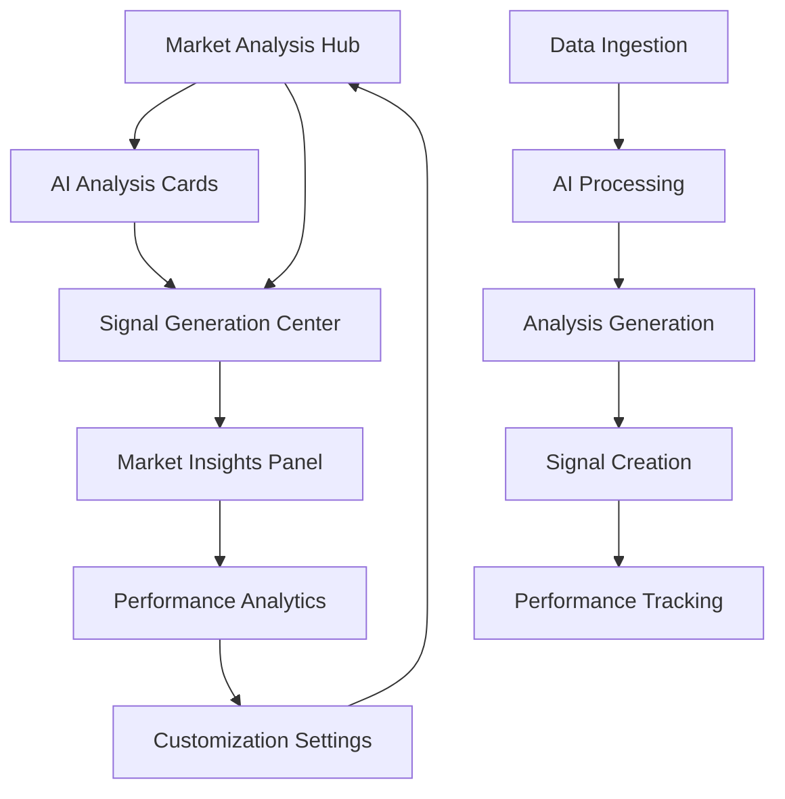

# AI-Powered Market Analysis Dashboard - Product Requirements

## 1. Product Overview

An intelligent market analysis dashboard that leverages AI to provide comprehensive forex market insights, trading signals, and performance analytics. The dashboard combines technical and fundamental analysis with machine learning to deliver actionable trading intelligence with confidence metrics and real-time market sentiment analysis.

The platform serves professional traders and analysts who need AI-driven market insights to make informed trading decisions, reducing analysis time while improving decision accuracy through advanced pattern recognition and sentiment analysis.

## 2. Core Features

### 2.1 User Roles

| Role                 | Registration Method  | Core Permissions                                           |
| -------------------- | -------------------- | ---------------------------------------------------------- |
| Basic Trader         | Email registration   | Access to basic AI analysis, limited signals per day       |
| Premium Trader       | Subscription upgrade | Full AI analysis suite, unlimited signals, custom settings |
| Professional Analyst | Enterprise license   | Advanced AI models, performance analytics, API access      |

### 2.2 Feature Module

Our AI market analysis dashboard consists of the following main sections:

1. **Market Analysis Hub**: Main dashboard with market overview, AI confidence meters, sentiment gauges, support/resistance levels, trading opportunities spotlight.
2. **AI Analysis Cards**: Technical analysis summary with trend direction and confidence, fundamental analysis with economic impact and news sentiment.
3. **Signal Generation Center**: AI-generated trading signals with strength indicators, entry/exit levels, risk calculations, expiration timers.
4. **Market Insights Panel**: Daily AI commentary, key events, currency recommendations, market regime identification, volatility forecasts.
5. **Performance Analytics**: AI signal performance history, success rates, best performing signal types, learning progress indicators.
6. **Customization Settings**: Currency pair preferences, analysis frequency, risk tolerance, notification settings, AI model selection.

### 2.3 Page Details

| Page Name                | Module Name                     | Feature description                                                                                    |
| ------------------------ | ------------------------------- | ------------------------------------------------------------------------------------------------------ |
| Market Analysis Hub      | Market Overview Widget          | Display real-time market trends, price movements, volatility indicators with AI-powered trend analysis |
| Market Analysis Hub      | AI Confidence Meter             | Show confidence percentage (0-100%) for each AI analysis with color-coded visual indicators            |
| Market Analysis Hub      | Market Sentiment Gauge          | Real-time sentiment analysis from news, social media, and market data with bullish/bearish indicators  |
| Market Analysis Hub      | Key Levels Identification       | Automatically identify and display support/resistance levels with strength ratings                     |
| Market Analysis Hub      | Trading Opportunities Spotlight | Highlight top AI-identified trading opportunities with risk/reward ratios                              |
| AI Analysis Cards        | Technical Analysis Summary      | Display trend direction with confidence percentage, key indicator readings (RSI, MACD, etc.)           |
| AI Analysis Cards        | Price Pattern Recognition       | Identify chart patterns (triangles, head & shoulders, etc.) with formation probability                 |
| AI Analysis Cards        | Volatility Assessment           | Analyze current and predicted volatility levels with historical comparisons                            |
| AI Analysis Cards        | Fundamental Analysis            | Show economic calendar impact, news sentiment analysis, currency strength meter                        |
| AI Analysis Cards        | Risk Indicator                  | Display risk-on/risk-off market sentiment with correlation analysis                                    |
| Signal Generation Center | AI Trading Signals              | Generate buy/sell signals with detailed reasoning and market context                                   |
| Signal Generation Center | Signal Strength Indicator       | Rate signals from 1-5 stars based on AI confidence and historical performance                          |
| Signal Generation Center | Entry/Exit Levels               | Provide precise entry points, stop loss, and take profit levels                                        |
| Signal Generation Center | Risk/Reward Calculator          | Calculate and display risk/reward ratios for each signal                                               |
| Signal Generation Center | Signal Timer                    | Show signal expiration countdown with validity period                                                  |
| Market Insights Panel    | Daily Commentary                | AI-generated market analysis and commentary with key insights                                          |
| Market Insights Panel    | Key Events Tracker              | Display important economic events and their potential market impact                                    |
| Market Insights Panel    | Currency Recommendations        | Suggest best currency pairs to trade based on current conditions                                       |
| Market Insights Panel    | Market Regime Detector          | Identify current market regime (trending, ranging, volatile)                                           |
| Market Insights Panel    | Volatility Forecast             | Predict short-term volatility changes with confidence intervals                                        |
| Performance Analytics    | Signal Performance History      | Track historical performance of AI signals with detailed statistics                                    |
| Performance Analytics    | Success Rate Analysis           | Display success rates by time period, signal type, and market conditions                               |
| Performance Analytics    | Performance Metrics             | Show best performing signal types and market condition analysis                                        |
| Performance Analytics    | Learning Progress               | Display AI model learning progress and improvement metrics                                             |
| Customization Settings   | Currency Pair Selection         | Allow users to select preferred currency pairs for analysis                                            |
| Customization Settings   | Analysis Frequency              | Configure how often AI analysis updates (real-time, hourly, daily)                                     |
| Customization Settings   | Risk Tolerance                  | Set risk tolerance levels affecting signal generation and recommendations                              |
| Customization Settings   | Notification Preferences        | Configure alerts for signals, market events, and analysis updates                                      |
| Customization Settings   | AI Model Selection              | Choose between Conservative and Aggressive AI analysis models                                          |

## 3. Core Process

**Main User Flow:**

1. User accesses the Market Analysis Hub to view overall market conditions and AI confidence levels
2. User reviews AI Analysis Cards for detailed technical and fundamental insights
3. User checks Signal Generation Center for trading opportunities with risk assessments
4. User reads Market Insights Panel for daily commentary and key events
5. User monitors Performance Analytics to track AI signal success rates
6. User customizes settings based on trading preferences and risk tolerance

**AI Analysis Flow:**

1. System continuously ingests market data, news, and economic indicators
2. AI models process data to generate technical and fundamental analysis
3. Confidence metrics are calculated for each analysis component
4. Trading signals are generated with strength ratings and risk calculations
5. Performance tracking updates historical success rates and learning metrics

## 4. User Interface Design

### 4.1 Design Style

* Primary colors: Deep blue (#1e40af) for trust and professionalism, green (#10b981) for positive signals

* Secondary colors: Red (#ef4444) for negative signals, amber (#f59e0b) for warnings

* Button style: Modern rounded buttons with subtle shadows and hover effects

* Font: Inter or similar modern sans-serif, 14px base size, 16px for headings

* Layout style: Card-based design with clean grid layout, dark theme support

* Icons: Lucide React icons for consistency, data visualization icons for charts

### 4.2 Page Design Overview

| Page Name                | Module Name            | UI Elements                                                                                 |
| ------------------------ | ---------------------- | ------------------------------------------------------------------------------------------- |
| Market Analysis Hub      | Market Overview Widget | Large trend chart with color-coded indicators, real-time price tickers, volatility heat map |
| Market Analysis Hub      | AI Confidence Meter    | Circular progress indicators with percentage display, color gradient from red to green      |
| Market Analysis Hub      | Market Sentiment Gauge | Semi-circular gauge with needle indicator, bullish/bearish color coding                     |
| AI Analysis Cards        | Technical Analysis     | Card layout with trend arrows, confidence badges, indicator readings in tabular format      |
| AI Analysis Cards        | Fundamental Analysis   | News sentiment cards with impact ratings, currency strength radar chart                     |
| Signal Generation Center | Trading Signals        | Signal cards with star ratings, entry/exit level displays, countdown timers                 |
| Market Insights Panel    | Daily Commentary       | Text-based insights with highlighted key points, expandable sections                        |
| Performance Analytics    | Performance Charts     | Line charts for success rates, bar charts for signal performance, progress indicators       |
| Customization Settings   | Settings Panel         | Toggle switches, dropdown selectors, slider controls for preferences                        |

### 4.3 Responsiveness

Desktop-first design with mobile-adaptive layout. Touch-optimized controls for mobile devices with swipe gestures for card navigation and pinch-to-zoom for charts.

## 5. Data Visualization Requirements

* Real-time charts using Chart.js or D3.js for market data visualization

* Gauge components for sentiment and confidence meters

* Progress indicators for AI confidence and performance metrics

* Heat maps for volatility and currency strength visualization

* Interactive tooltips and hover effects for detailed information

* Responsive chart scaling for different screen sizes

