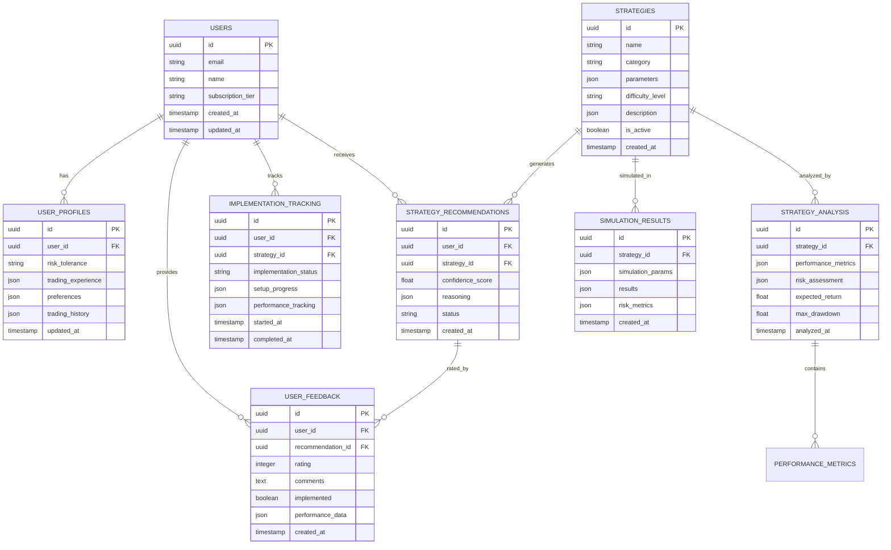

# AI-Powered Strategy Recommendation System - Technical Architecture Document

## 1. Architecture Design


## 2. Technology Description

* Frontend: React\@18 + TypeScript + Tailwind CSS\@3 + Vite

* State Management: Zustand for global state

* UI Components: Headless UI + Radix UI primitives

* Charts: Recharts for analytics, TradingView widgets for market data

* Backend: Supabase (Authentication, Database, Real-time subscriptions)

* AI/ML: OpenAI API for strategy analysis and recommendations

* Market Data: Alpha Vantage or Polygon.io API

## 3. Route Definitions

| Route                       | Purpose                                                     |
| --------------------------- | ----------------------------------------------------------- |
| /                           | Landing page with system overview and login                 |
| /onboarding                 | Interactive user profiling and tutorial flow                |
| /dashboard                  | Main recommendation dashboard with personalized suggestions |
| /strategy/:id               | Detailed strategy analysis and performance prediction       |
| /compare                    | Interactive strategy comparison tool                        |
| /tools                      | Monte Carlo simulation and parameter analysis tools         |
| /education                  | Educational hub with tutorials and best practices           |
| /implementation/:strategyId | Step-by-step implementation assistant                       |
| /feedback                   | User feedback center and performance tracking               |
| /profile                    | User profile and preferences management                     |
| /settings                   | System settings and notification preferences                |

## 4. API Definitions

### 4.1 Core API

**Strategy Recommendations**

```
GET /api/recommendations
```

Request:

| Param Name         | Param Type | isRequired | Description                           |
| ------------------ | ---------- | ---------- | ------------------------------------- |
| user\_id           | string     | true       | User identifier                       |
| risk\_profile      | string     | false      | User risk tolerance (low/medium/high) |
| market\_conditions | string     | false      | Current market state filter           |

Response:

| Param Name                 | Param Type | Description                                  |
| -------------------------- | ---------- | -------------------------------------------- |
| recommendations            | array      | List of recommended strategies               |
| confidence\_scores         | array      | AI confidence levels for each recommendation |
| implementation\_difficulty | array      | Difficulty ratings (1-5 scale)               |

**Strategy Analysis**

```
POST /api/strategy/analyze
```

Request:

| Param Name   | Param Type | isRequired | Description                            |
| ------------ | ---------- | ---------- | -------------------------------------- |
| strategy\_id | string     | true       | Strategy identifier                    |
| parameters   | object     | true       | Strategy parameters for analysis       |
| market\_data | object     | false      | Historical market data for backtesting |

Response:

| Param Name              | Param Type | Description                                   |
| ----------------------- | ---------- | --------------------------------------------- |
| performance\_prediction | object     | Expected returns, volatility, Sharpe ratio    |
| risk\_metrics           | object     | VaR, maximum drawdown, risk score             |
| win\_rate               | number     | Estimated win rate percentage                 |
| market\_suitability     | object     | Performance under different market conditions |

**Monte Carlo Simulation**

```
POST /api/simulation/monte-carlo
```

Request:

| Param Name         | Param Type | isRequired | Description                                        |
| ------------------ | ---------- | ---------- | -------------------------------------------------- |
| strategy\_config   | object     | true       | Strategy configuration and parameters              |
| simulation\_params | object     | true       | Number of runs, time horizon, confidence intervals |

Response:

| Param Name                | Param Type | Description                                  |
| ------------------------- | ---------- | -------------------------------------------- |
| simulation\_results       | object     | Distribution of outcomes, percentiles        |
| risk\_metrics             | object     | Probability of loss, expected shortfall      |
| optimization\_suggestions | array      | Parameter adjustments for better performance |

## 5. Server Architecture Diagram


## 6. Data Model

### 6.1 Data Model Definition



### 6.2 Data Definition Language

**Users Table**

```sql
-- Create users table
CREATE TABLE users (
    id UUID PRIMARY KEY DEFAULT gen_random_uuid(),
    email VARCHAR(255) UNIQUE NOT NULL,
    name VARCHAR(100) NOT NULL,
    subscription_tier VARCHAR(20) DEFAULT 'free' CHECK (subscription_tier IN ('free', 'premium', 'professional')),
    created_at TIMESTAMP WITH TIME ZONE DEFAULT NOW(),
    updated_at TIMESTAMP WITH TIME ZONE DEFAULT NOW()
);

-- Create user profiles table
CREATE TABLE user_profiles (
    id UUID PRIMARY KEY DEFAULT gen_random_uuid(),
    user_id UUID REFERENCES users(id) ON DELETE CASCADE,
    risk_tolerance VARCHAR(20) CHECK (risk_tolerance IN ('low', 'medium', 'high')),
    trading_experience JSONB DEFAULT '{}',
    preferences JSONB DEFAULT '{}',
    trading_history JSONB DEFAULT '{}',
    updated_at TIMESTAMP WITH TIME ZONE DEFAULT NOW()
);

-- Create strategies table
CREATE TABLE strategies (
    id UUID PRIMARY KEY DEFAULT gen_random_uuid(),
    name VARCHAR(200) NOT NULL,
    category VARCHAR(50) NOT NULL,
    parameters JSONB NOT NULL DEFAULT '{}',
    difficulty_level VARCHAR(20) CHECK (difficulty_level IN ('beginner', 'intermediate', 'advanced', 'expert')),
    description JSONB DEFAULT '{}',
    is_active BOOLEAN DEFAULT true,
    created_at TIMESTAMP WITH TIME ZONE DEFAULT NOW()
);

-- Create strategy recommendations table
CREATE TABLE strategy_recommendations (
    id UUID PRIMARY KEY DEFAULT gen_random_uuid(),
    user_id UUID REFERENCES users(id) ON DELETE CASCADE,
    strategy_id UUID REFERENCES strategies(id) ON DELETE CASCADE,
    confidence_score DECIMAL(3,2) CHECK (confidence_score >= 0 AND confidence_score <= 1),
    reasoning JSONB DEFAULT '{}',
    status VARCHAR(20) DEFAULT 'pending' CHECK (status IN ('pending', 'viewed', 'implemented', 'dismissed')),
    created_at TIMESTAMP WITH TIME ZONE DEFAULT NOW()
);

-- Create strategy analysis table
CREATE TABLE strategy_analysis (
    id UUID PRIMARY KEY DEFAULT gen_random_uuid(),
    strategy_id UUID REFERENCES strategies(id) ON DELETE CASCADE,
    performance_metrics JSONB NOT NULL DEFAULT '{}',
    risk_assessment JSONB NOT NULL DEFAULT '{}',
    expected_return DECIMAL(8,4),
    max_drawdown DECIMAL(8,4),
    analyzed_at TIMESTAMP WITH TIME ZONE DEFAULT NOW()
);

-- Create user feedback table
CREATE TABLE user_feedback (
    id UUID PRIMARY KEY DEFAULT gen_random_uuid(),
    user_id UUID REFERENCES users(id) ON DELETE CASCADE,
    recommendation_id UUID REFERENCES strategy_recommendations(id) ON DELETE CASCADE,
    rating INTEGER CHECK (rating >= 1 AND rating <= 5),
    comments TEXT,
    implemented BOOLEAN DEFAULT false,
    performance_data JSONB DEFAULT '{}',
    created_at TIMESTAMP WITH TIME ZONE DEFAULT NOW()
);

-- Create simulation results table
CREATE TABLE simulation_results (
    id UUID PRIMARY KEY DEFAULT gen_random_uuid(),
    strategy_id UUID REFERENCES strategies(id) ON DELETE CASCADE,
    simulation_params JSONB NOT NULL DEFAULT '{}',
    results JSONB NOT NULL DEFAULT '{}',
    risk_metrics JSONB NOT NULL DEFAULT '{}',
    created_at TIMESTAMP WITH TIME ZONE DEFAULT NOW()
);

-- Create implementation tracking table
CREATE TABLE implementation_tracking (
    id UUID PRIMARY KEY DEFAULT gen_random_uuid(),
    user_id UUID REFERENCES users(id) ON DELETE CASCADE,
    strategy_id UUID REFERENCES strategies(id) ON DELETE CASCADE,
    implementation_status VARCHAR(20) DEFAULT 'not_started' CHECK (implementation_status IN ('not_started', 'in_progress', 'testing', 'live', 'paused', 'stopped')),
    setup_progress JSONB DEFAULT '{}',
    performance_tracking JSONB DEFAULT '{}',
    started_at TIMESTAMP WITH TIME ZONE,
    completed_at TIMESTAMP WITH TIME ZONE
);

-- Create indexes for better performance
CREATE INDEX idx_user_profiles_user_id ON user_profiles(user_id);
CREATE INDEX idx_strategy_recommendations_user_id ON strategy_recommendations(user_id);
CREATE INDEX idx_strategy_recommendations_created_at ON strategy_recommendations(created_at DESC);
CREATE INDEX idx_user_feedback_user_id ON user_feedback(user_id);
CREATE INDEX idx_user_feedback_rating ON user_feedback(rating DESC);
CREATE INDEX idx_implementation_tracking_user_id ON implementation_tracking(user_id);
CREATE INDEX idx_simulation_results_strategy_id ON simulation_results(strategy_id);

-- Grant permissions
GRANT SELECT ON ALL TABLES IN SCHEMA public TO anon;
GRANT ALL PRIVILEGES ON ALL TABLES IN SCHEMA public TO authenticated;

-- Insert initial strategy data
INSERT INTO strategies (name, category, parameters, difficulty_level, description) VALUES
('Moving Average Crossover', 'trend_following', '{"short_period": 10, "long_period": 20}', 'beginner', '{"summary": "Simple trend following strategy using moving average crossovers"}'),
('RSI Mean Reversion', 'mean_reversion', '{"rsi_period": 14, "oversold": 30, "overbought": 70}', 'intermediate', '{"summary": "Mean reversion strategy based on RSI indicators"}'),
('Bollinger Band Squeeze', 'volatility', '{"period": 20, "std_dev": 2, "squeeze_threshold": 0.1}', 'advanced', '{"summary": "Volatility breakout strategy using Bollinger Bands"}');
```

