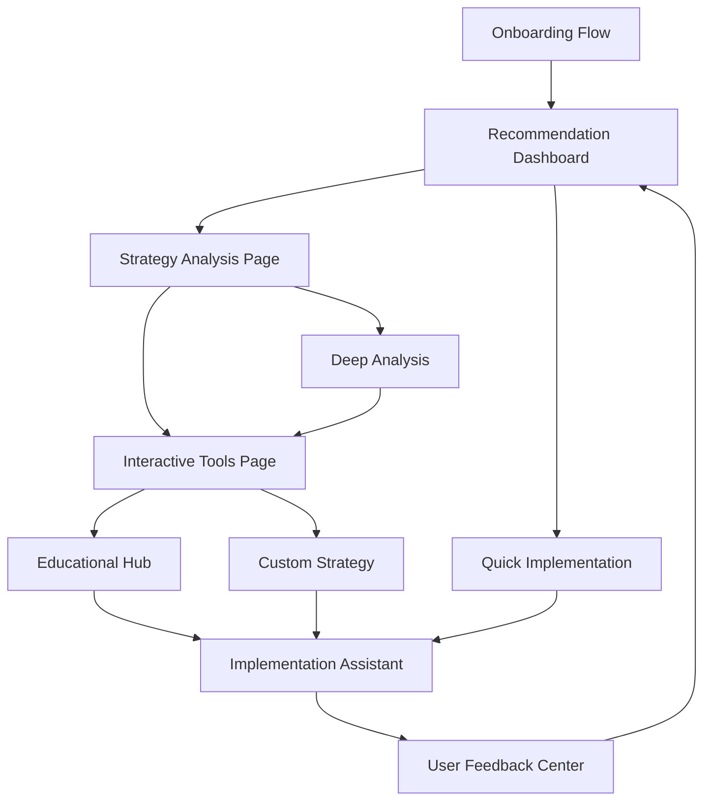

# AI-Powered Strategy Recommendation System - Requirements Document

## 1. Product Overview

An intelligent trading strategy recommendation system that provides personalized strategy suggestions based on user trading history, risk profile, and market conditions. The system uses AI/ML algorithms to analyze user behavior, predict strategy performance, and guide users through implementation with educational content and step-by-step assistance.

The system aims to democratize advanced trading strategies by making them accessible to traders of all experience levels while providing sophisticated analysis tools for professional traders.

## 2. Core Features

### 2.1 User Roles

| Role | Registration Method | Core Permissions |
|------|---------------------|------------------|
| Beginner Trader | Email registration | Access basic recommendations, educational content, guided tutorials |
| Intermediate Trader | Profile assessment upgrade | Access advanced analysis, strategy comparison, parameter modification |
| Advanced Trader | Trading history verification | Full access including Monte Carlo simulation, custom strategy creation |
| Premium User | Subscription upgrade | Priority recommendations, advanced analytics, personalized coaching |

### 2.2 Feature Module

Our AI-powered strategy recommendation system consists of the following main pages:

1. **Recommendation Dashboard**: personalized strategy suggestions, confidence scoring, implementation difficulty rating
2. **Strategy Analysis Page**: performance prediction, market suitability analysis, risk assessment scoring
3. **Interactive Tools Page**: strategy comparison, parameter sensitivity analysis, Monte Carlo simulation
4. **User Feedback Center**: rating system, implementation tracking, performance feedback collection
5. **Educational Hub**: strategy explanations, risk management tutorials, best practices guide
6. **Implementation Assistant**: step-by-step setup, parameter configuration, testing recommendations
7. **Onboarding Flow**: interactive tutorials, user profiling, system introduction

### 2.3 Page Details

| Page Name | Module Name | Feature Description |
|-----------|-------------|---------------------|
| Recommendation Dashboard | Strategy Suggestions | Display personalized strategy recommendations based on user profile, trading history, and current market conditions |
| Recommendation Dashboard | Confidence Scoring | Show AI confidence levels for each recommendation with detailed reasoning |
| Recommendation Dashboard | Difficulty Rating | Rate implementation complexity from beginner to expert level |
| Strategy Analysis Page | Performance Prediction | Predict strategy performance using historical data and AI models |
| Strategy Analysis Page | Market Suitability | Analyze strategy effectiveness under different market conditions |
| Strategy Analysis Page | Risk Assessment | Calculate and display comprehensive risk metrics and scores |
| Strategy Analysis Page | Win Rate Estimation | Estimate expected win rates based on historical performance |
| Strategy Analysis Page | Drawdown Analysis | Predict maximum drawdown expectations and recovery times |
| Interactive Tools Page | Strategy Comparison | Side-by-side comparison of multiple strategies with key metrics |
| Interactive Tools Page | Parameter Sensitivity | Analyze how parameter changes affect strategy performance |
| Interactive Tools Page | Monte Carlo Simulation | Run probabilistic simulations to test strategy robustness |
| Interactive Tools Page | Optimization Engine | Suggest parameter optimizations for improved performance |
| Interactive Tools Page | Custom Modifications | Allow users to modify strategy parameters and test results |
| User Feedback Center | Rating System | Rate strategy recommendations and provide detailed feedback |
| User Feedback Center | Implementation Tracking | Mark strategies as implemented and track real performance |
| User Feedback Center | Performance Collection | Collect and analyze user performance data for system improvement |
| User Feedback Center | Preference Learning | Update user preferences based on feedback and behavior |
| User Feedback Center | Success Stories | Share and browse successful strategy implementations |
| Educational Hub | Strategy Explanations | Explain complex strategies in simple, understandable terms |
| Educational Hub | Risk Management | Comprehensive risk management education and best practices |
| Educational Hub | Market Concepts | Interactive tutorials on market concepts and trading fundamentals |
| Educational Hub | Best Practices | Curated recommendations and industry best practices |
| Educational Hub | Common Mistakes | Warning system for common trading mistakes and how to avoid them |
| Implementation Assistant | Setup Guide | Step-by-step strategy implementation with visual guides |
| Implementation Assistant | Parameter Configuration | Interactive parameter setup with real-time validation |
| Implementation Assistant | Testing Framework | Recommendations for backtesting and paper trading |
| Implementation Assistant | Go-Live Checklist | Comprehensive checklist before live trading implementation |
| Implementation Assistant | Monitoring Dashboard | Guidelines and tools for ongoing strategy monitoring |
| Onboarding Flow | User Profiling | Interactive questionnaire to assess user experience and goals |
| Onboarding Flow | System Introduction | Guided tour of system features and capabilities |
| Onboarding Flow | Tutorial Modules | Interactive tutorials for each major system component |

## 3. Core Process

### Main User Flow

1. **Onboarding**: New users complete profile assessment and interactive tutorials
2. **Dashboard Access**: Users view personalized strategy recommendations with confidence scores
3. **Strategy Analysis**: Users explore detailed analysis including performance predictions and risk assessments
4. **Interactive Exploration**: Users compare strategies, run simulations, and optimize parameters
5. **Education**: Users access educational content to understand strategies and risk management
6. **Implementation**: Users follow step-by-step guides to implement chosen strategies
7. **Feedback Loop**: Users provide feedback and track performance for continuous system improvement

### Advanced User Flow

1. **Advanced Analysis**: Access Monte Carlo simulations and sensitivity analysis
2. **Custom Modifications**: Modify strategy parameters and test custom variations
3. **Performance Tracking**: Monitor implemented strategies and provide detailed feedback
4. **Community Engagement**: Share success stories and learn from other users

## 4. User Interface Design

### 4.1 Design Style

- **Primary Colors**: Deep blue (#1e40af) for trust and professionalism, green (#059669) for positive performance
- **Secondary Colors**: Orange (#ea580c) for warnings, red (#dc2626) for risks, gray (#6b7280) for neutral elements
- **Button Style**: Rounded corners with subtle shadows, gradient backgrounds for primary actions
- **Font**: Inter for headings (16-24px), system fonts for body text (14-16px)
- **Layout Style**: Card-based design with clean spacing, top navigation with breadcrumbs
- **Icons**: Lucide React icons for consistency, custom AI/chart icons for specialized features

### 4.2 Page Design Overview

| Page Name | Module Name | UI Elements |
|-----------|-------------|-------------|
| Recommendation Dashboard | Strategy Cards | Card layout with confidence meters, difficulty badges, performance previews |
| Strategy Analysis Page | Analysis Panels | Tabbed interface with charts, metrics tables, risk visualizations |
| Interactive Tools Page | Comparison Grid | Side-by-side layout with synchronized scrolling, interactive charts |
| User Feedback Center | Feedback Forms | Star ratings, comment boxes, progress tracking with visual indicators |
| Educational Hub | Content Modules | Progressive disclosure, interactive elements, video integration |
| Implementation Assistant | Step Wizard | Multi-step form with progress indicator, validation feedback |
| Onboarding Flow | Tutorial Overlay | Modal overlays, guided highlights, interactive tooltips |

### 4.3 Responsiveness

Desktop-first approach with mobile-adaptive design. Touch interaction optimization for mobile devices including swipe gestures for strategy comparison and tap-friendly interface elements. Responsive breakpoints at 768px (tablet) and 1024px (desktop).