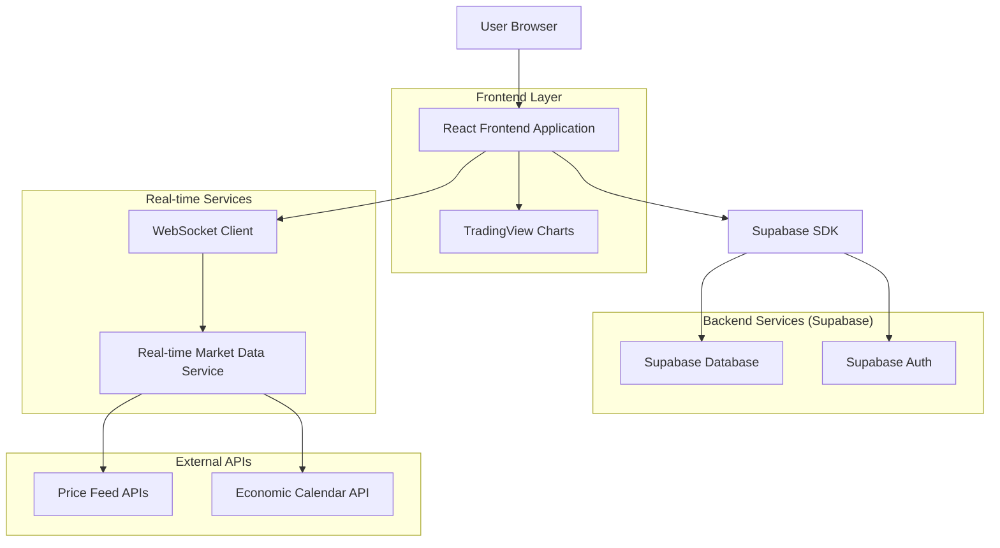
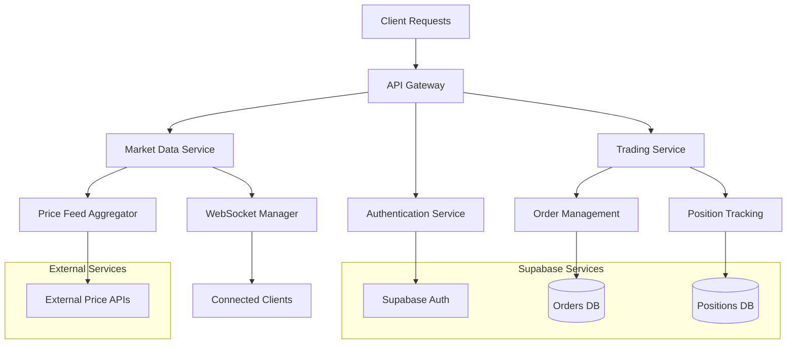
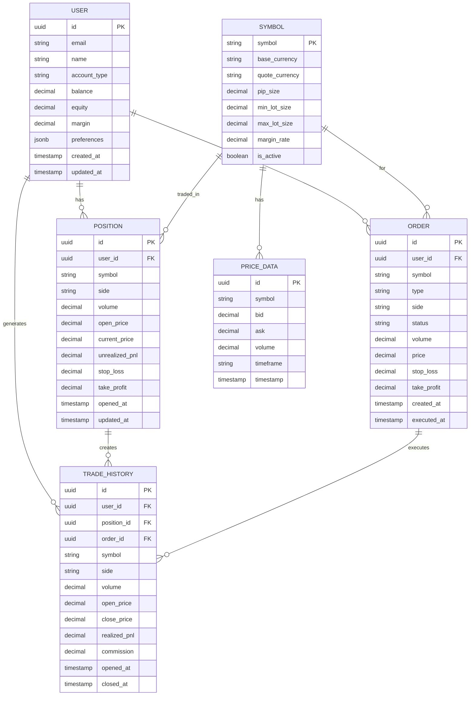

# Live Trading Interface - Technical Architecture Document

## 1. Architecture Design



## 2. Technology Description

* **Frontend**: React\@18 + TypeScript + Vite + TailwindCSS\@3

* **Charts**: TradingView Lightweight Charts\@4

* **Real-time**: WebSocket + Socket.io-client

* **Backend**: Supabase (PostgreSQL + Auth + Real-time)

* **State Management**: Zustand + React Query

* **UI Components**: Headless UI + Radix UI

* **Form Handling**: React Hook Form + Zod validation

* **Audio**: Web Audio API

* **Layout**: React Resizable Panels

## 3. Route Definitions

| Route            | Purpose                                                   |
| ---------------- | --------------------------------------------------------- |
| /trading         | Main live trading interface with charts and trading panel |
| /positions       | Position management and portfolio overview                |
| /market-analysis | Economic calendar and market sentiment dashboard          |
| /settings        | Account settings and trading preferences                  |
| /history         | Trade history and performance analytics                   |
| /login           | User authentication and login                             |
| /register        | New user registration with KYC                            |

## 4. API Definitions

### 4.1 Core Trading APIs

**Market Data WebSocket Connection**

```
WS /api/market-data
```

Subscription Message:

| Param Name | Param Type | isRequired | Description                               |
| ---------- | ---------- | ---------- | ----------------------------------------- |
| action     | string     | true       | "subscribe" or "unsubscribe"              |
| symbols    | string\[]  | true       | Array of currency pairs                   |
| timeframe  | string     | false      | Chart timeframe (1m, 5m, 15m, 1h, 4h, 1d) |

Response:

| Param Name | Param Type | Description          |
| ---------- | ---------- | -------------------- |
| symbol     | string     | Currency pair symbol |
| bid        | number     | Current bid price    |
| ask        | number     | Current ask price    |
| timestamp  | number     | Unix timestamp       |
| volume     | number     | Trading volume       |

**Place Order**

```
POST /api/orders
```

Request:

| Param Name | Param Type | isRequired | Description               |
| ---------- | ---------- | ---------- | ------------------------- |
| symbol     | string     | true       | Currency pair             |
| type       | string     | true       | "market", "limit", "stop" |
| side       | string     | true       | "buy" or "sell"           |
| volume     | number     | true       | Lot size                  |
| price      | number     | false      | Limit/stop price          |
| stopLoss   | number     | false      | Stop loss price           |
| takeProfit | number     | false      | Take profit price         |

Response:

| Param Name | Param Type | Description             |
| ---------- | ---------- | ----------------------- |
| orderId    | string     | Unique order identifier |
| status     | string     | Order status            |
| executedAt | string     | Execution timestamp     |

Example:

```json
{
  "symbol": "EURUSD",
  "type": "market",
  "side": "buy",
  "volume": 0.1,
  "stopLoss": 1.0950,
  "takeProfit": 1.1050
}
```

**Get Positions**

```
GET /api/positions
```

Response:

| Param Name | Param Type  | Description             |
| ---------- | ----------- | ----------------------- |
| positions  | Position\[] | Array of open positions |
| totalPnL   | number      | Total unrealized P\&L   |
| margin     | number      | Used margin             |
| freeMargin | number      | Available margin        |

**Economic Calendar**

```
GET /api/economic-calendar
```

Query Parameters:

| Param Name | Param Type | isRequired | Description             |
| ---------- | ---------- | ---------- | ----------------------- |
| from       | string     | true       | Start date (YYYY-MM-DD) |
| to         | string     | true       | End date (YYYY-MM-DD)   |
| impact     | string     | false      | "low", "medium", "high" |

Response:

| Param Name | Param Type       | Description              |
| ---------- | ---------------- | ------------------------ |
| events     | EconomicEvent\[] | Array of economic events |

## 5. Server Architecture Diagram



## 6. Data Model

### 6.1 Data Model Definition



### 6.2 Data Definition Language

**Users Table**

```sql
-- Create users table
CREATE TABLE users (
    id UUID PRIMARY KEY DEFAULT gen_random_uuid(),
    email VARCHAR(255) UNIQUE NOT NULL,
    name VARCHAR(100) NOT NULL,
    account_type VARCHAR(20) DEFAULT 'demo' CHECK (account_type IN ('demo', 'live')),
    balance DECIMAL(15,2) DEFAULT 10000.00,
    equity DECIMAL(15,2) DEFAULT 10000.00,
    margin DECIMAL(15,2) DEFAULT 0.00,
    preferences JSONB DEFAULT '{}',
    created_at TIMESTAMP WITH TIME ZONE DEFAULT NOW(),
    updated_at TIMESTAMP WITH TIME ZONE DEFAULT NOW()
);

-- Create indexes
CREATE INDEX idx_users_email ON users(email);
CREATE INDEX idx_users_account_type ON users(account_type);
```

**Positions Table**

```sql
-- Create positions table
CREATE TABLE positions (
    id UUID PRIMARY KEY DEFAULT gen_random_uuid(),
    user_id UUID NOT NULL REFERENCES users(id) ON DELETE CASCADE,
    symbol VARCHAR(10) NOT NULL,
    side VARCHAR(4) NOT NULL CHECK (side IN ('buy', 'sell')),
    volume DECIMAL(10,2) NOT NULL,
    open_price DECIMAL(10,5) NOT NULL,
    current_price DECIMAL(10,5) NOT NULL,
    unrealized_pnl DECIMAL(15,2) DEFAULT 0.00,
    stop_loss DECIMAL(10,5),
    take_profit DECIMAL(10,5),
    opened_at TIMESTAMP WITH TIME ZONE DEFAULT NOW(),
    updated_at TIMESTAMP WITH TIME ZONE DEFAULT NOW()
);

-- Create indexes
CREATE INDEX idx_positions_user_id ON positions(user_id);
CREATE INDEX idx_positions_symbol ON positions(symbol);
CREATE INDEX idx_positions_opened_at ON positions(opened_at DESC);
```

**Orders Table**

```sql
-- Create orders table
CREATE TABLE orders (
    id UUID PRIMARY KEY DEFAULT gen_random_uuid(),
    user_id UUID NOT NULL REFERENCES users(id) ON DELETE CASCADE,
    symbol VARCHAR(10) NOT NULL,
    type VARCHAR(10) NOT NULL CHECK (type IN ('market', 'limit', 'stop')),
    side VARCHAR(4) NOT NULL CHECK (side IN ('buy', 'sell')),
    status VARCHAR(10) DEFAULT 'pending' CHECK (status IN ('pending', 'executed', 'cancelled', 'rejected')),
    volume DECIMAL(10,2) NOT NULL,
    price DECIMAL(10,5),
    stop_loss DECIMAL(10,5),
    take_profit DECIMAL(10,5),
    created_at TIMESTAMP WITH TIME ZONE DEFAULT NOW(),
    executed_at TIMESTAMP WITH TIME ZONE
);

-- Create indexes
CREATE INDEX idx_orders_user_id ON orders(user_id);
CREATE INDEX idx_orders_status ON orders(status);
CREATE INDEX idx_orders_created_at ON orders(created_at DESC);
```

**Symbols Table**

```sql
-- Create symbols table
CREATE TABLE symbols (
    symbol VARCHAR(10) PRIMARY KEY,
    base_currency VARCHAR(3) NOT NULL,
    quote_currency VARCHAR(3) NOT NULL,
    pip_size DECIMAL(10,8) NOT NULL DEFAULT 0.0001,
    min_lot_size DECIMAL(10,2) DEFAULT 0.01,
    max_lot_size DECIMAL(10,2) DEFAULT 100.00,
    margin_rate DECIMAL(5,4) DEFAULT 0.0200,
    is_active BOOLEAN DEFAULT true
);

-- Insert initial data
INSERT INTO symbols (symbol, base_currency, quote_currency, pip_size, min_lot_size, max_lot_size, margin_rate) VALUES
('EURUSD', 'EUR', 'USD', 0.0001, 0.01, 100.00, 0.0200),
('GBPUSD', 'GBP', 'USD', 0.0001, 0.01, 100.00, 0.0200),
('USDJPY', 'USD', 'JPY', 0.01, 0.01, 100.00, 0.0200),
('USDCHF', 'USD', 'CHF', 0.0001, 0.01, 100.00, 0.0200),
('AUDUSD', 'AUD', 'USD', 0.0001, 0.01, 100.00, 0.0200);
```

**Row Level Security (RLS) Policies**

```sql
-- Enable RLS
ALTER TABLE users ENABLE ROW LEVEL SECURITY;
ALTER TABLE positions ENABLE ROW LEVEL SECURITY;
ALTER TABLE orders ENABLE ROW LEVEL SECURITY;

-- Users can only see their own data
CREATE POLICY "Users can view own profile" ON users
    FOR SELECT USING (auth.uid() = id);

CREATE POLICY "Users can update own profile" ON users
    FOR UPDATE USING (auth.uid() = id);

-- Positions policies
CREATE POLICY "Users can view own positions" ON positions
    FOR SELECT USING (auth.uid() = user_id);

CREATE POLICY "Users can insert own positions" ON positions
    FOR INSERT WITH CHECK (auth.uid() = user_id);

CREATE POLICY "Users can update own positions" ON positions
    FOR UPDATE USING (auth.uid() = user_id);

-- Orders policies
CREATE POLICY "Users can view own orders" ON orders
    FOR SELECT USING (auth.uid() = user_id);

CREATE POLICY "Users can insert own orders" ON orders
    FOR INSERT WITH CHECK (auth.uid() = user_id);

CREATE POLICY "Users can update own orders" ON orders
    FOR UPDATE USING (auth.uid() = user_id);

-- Grant permissions
GRANT SELECT ON symbols TO anon, authenticated;
GRANT ALL PRIVILEGES ON users TO authenticated;
GRANT ALL PRIVILEGES ON positions TO authenticated;
GRANT ALL PRIVILEGES ON orders TO authenticated;
```

