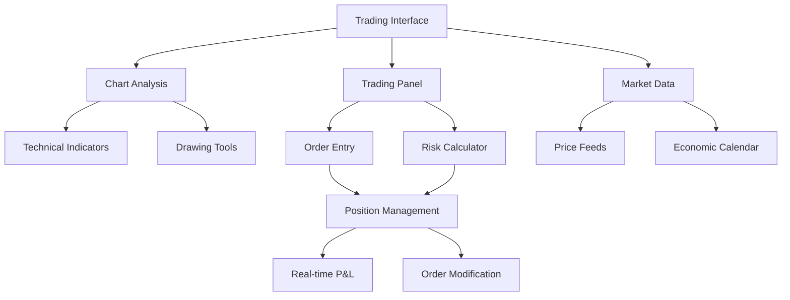

# Live Trading Interface - Product Requirements Document

## 1. Product Overview

A comprehensive live trading interface designed for forex and financial markets trading with real-time data visualization, advanced charting capabilities, and professional-grade trading tools. The platform provides traders with an intuitive yet powerful interface for executing trades, managing positions, and analyzing market data in real-time.

The system addresses the need for a modern, responsive trading platform that combines advanced charting with streamlined order execution, targeting both professional traders and retail investors who require institutional-quality tools with user-friendly design.

## 2. Core Features

### 2.1 User Roles

| Role      | Registration Method                            | Core Permissions                                         |
| --------- | ---------------------------------------------- | -------------------------------------------------------- |
| Trader    | Email/Phone registration with KYC verification | Full trading access, position management, chart analysis |
| Demo User | Quick registration without verification        | Paper trading only, limited features                     |
| Admin     | Internal system access                         | User management, system monitoring, configuration        |

### 2.2 Feature Module

Our live trading interface consists of the following main pages:

1. **Trading Interface**: Split-screen layout with advanced charting and trading panel
2. **Position Management**: Real-time portfolio overview and position tracking
3. **Market Analysis**: Economic calendar, market sentiment, and news feed
4. **Account Settings**: Profile management, trading preferences, and risk settings
5. **Trade History**: Historical trades, performance analytics, and reporting

### 2.3 Page Details

| Page Name           | Module Name         | Feature Description                                                                                               |
| ------------------- | ------------------- | ----------------------------------------------------------------------------------------------------------------- |
| Trading Interface   | Chart Area          | TradingView Lightweight Charts with multiple timeframes (1M-1D), technical indicators, drawing tools, volume bars |
| Trading Interface   | Trading Panel       | Currency pair selector with search, buy/sell buttons, order types (Market/Limit/Stop), lot size validation        |
| Trading Interface   | Layout Controls     | Resizable panes with drag handles, full-screen chart toggle, mobile-responsive stack layout                       |
| Trading Interface   | Risk Management     | Stop Loss/Take Profit inputs, risk calculator, position size visualization, one-click trading toggle              |
| Position Management | Open Positions      | Real-time P\&L tracking, quick close/modify buttons, position details with mobile-friendly cards                  |
| Position Management | Pending Orders      | Order queue management, modification controls, execution monitoring                                               |
| Market Analysis     | Price Feeds         | Real-time currency pair prices, spread information, market status indicators                                      |
| Market Analysis     | Sentiment Data      | Market sentiment indicators, volatility metrics, correlation analysis                                             |
| Market Analysis     | Economic Calendar   | Event scheduling, impact ratings, historical data comparison                                                      |
| Account Settings    | Trading Preferences | Keyboard shortcuts configuration, audio alert settings, layout customization                                      |
| Account Settings    | Risk Controls       | Position limits, maximum drawdown settings, confirmation dialogs                                                  |
| Trade History       | Transaction Log     | Complete trade history with filtering, export capabilities, performance metrics                                   |

## 3. Core Process

**Main Trading Flow:**
User accesses trading interface → Selects currency pair → Analyzes chart with technical indicators → Sets order parameters (type, size, SL/TP) → Executes trade → Monitors position in real-time → Closes or modifies position as needed.

**Risk Management Flow:**
User configures risk parameters → System calculates position size based on account balance → Validates order against risk limits → Displays warnings for high-risk trades → Requires confirmation for large positions → Monitors exposure in real-time.

**Mobile Trading Flow:**
User accesses mobile interface → Views stacked layout with chart on top → Swipes between chart and trading panel → Uses simplified order entry → Manages positions through card-based interface.

## 4. User Interface Design

### 4.1 Design Style

* **Primary Colors**: Dark theme with #1a1a1a background, #2d2d2d panels, #0066cc accent blue

* **Secondary Colors**: #00cc66 for profits, #cc0066 for losses, #ffaa00 for warnings

* **Button Style**: Rounded corners (8px), gradient backgrounds, hover animations

* **Typography**: Inter font family, 14px base size, 16px for headers, 12px for data tables

* **Layout Style**: Card-based design with subtle shadows, clean grid system, minimal borders

* **Icons**: Feather icons for consistency, custom trading-specific icons for orders

### 4.2 Page Design Overview

| Page Name           | Module Name     | UI Elements                                                                                      |
| ------------------- | --------------- | ------------------------------------------------------------------------------------------------ |
| Trading Interface   | Chart Area      | Dark theme with customizable grid, floating toolbar, resizable panels with 4px drag handles      |
| Trading Interface   | Trading Panel   | Compact form layout, color-coded buy/sell buttons, real-time price updates with flash animations |
| Position Management | Positions Table | Sortable columns, color-coded P\&L, quick action buttons, expandable rows for mobile             |
| Market Analysis     | Price Feed      | Ticker-style scrolling prices, heat map visualization, responsive grid layout                    |
| Account Settings    | Preferences     | Tabbed interface, toggle switches, slider controls, preview panels                               |

### 4.3 Responsiveness

Desktop-first design with mobile-adaptive breakpoints at 768px and 1024px. Touch-optimized controls for mobile with larger tap targets (44px minimum). Stacked layout on mobile with swipeable panels and collapsible sections.

## 5. Advanced Features

### 5.1 Keyboard Shortcuts

* **Enter**: Execute buy order

* **Space**: Execute sell order

* **Esc**: Cancel current order entry

* **Ctrl+Z**: Undo last chart drawing

* **F**: Toggle full-screen chart

* **1-6**: Switch timeframes (1M to 1D)

### 5.2 Audio Alerts

* Order fill confirmation sound

* Stop loss/take profit hit alerts

* Connection status change notifications

* Customizable volume and sound selection

### 5.3 Layout Customization

* Saveable workspace configurations

* Draggable panel arrangement

* Resizable component sizing

* Theme and color scheme options

### 5.4 Risk Management

* Real-time risk warnings

* Position size recommendations

* Maximum drawdown alerts

* Confirmation dialogs for large trades

* Account balance protection limits

### 5.5 Connection Monitoring

* Real-time connection status indicator

* Automatic reconnection attempts

* Offline mode with cached data

* Latency monitoring and display

* Server health status updates

