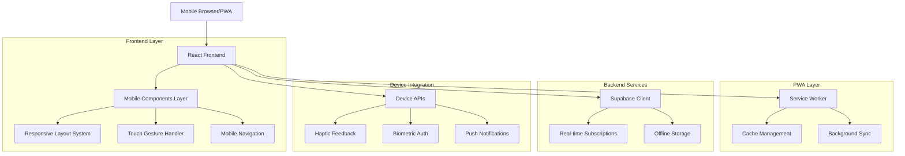
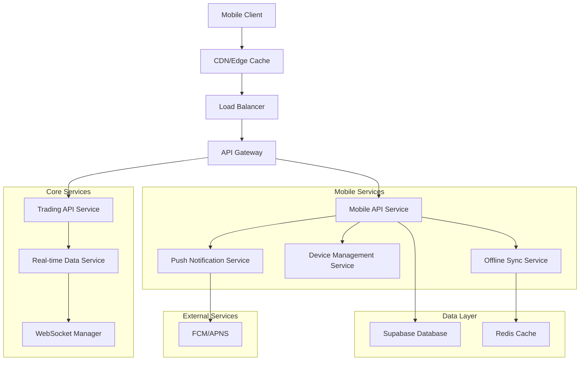
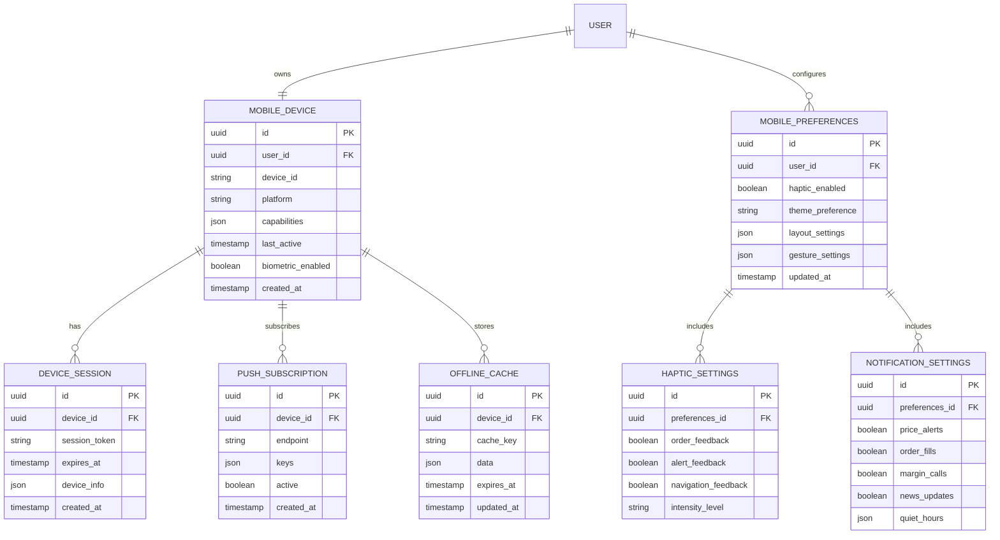

# Mobile Optimization Technical Architecture Document

## 1. Architecture Design



## 2. Technology Description

* **Frontend**: React\@18 + TypeScript + Vite + Tailwind CSS\@3

* **Mobile Framework**: PWA with Service Worker + Web App Manifest

* **Gesture Library**: @use-gesture/react for touch interactions

* **Animation**: Framer Motion (optimized for mobile performance)

* **State Management**: Zustand + React Query for offline-first data

* **UI Components**: Radix UI + Custom mobile-optimized components

* **Device APIs**: Web APIs (Vibration, Web Authentication, Push API)

* **Backend**: Supabase (PostgreSQL + Real-time + Auth + Storage)

* **Caching**: React Query + Service Worker + IndexedDB

* **Testing**: Playwright for mobile testing + Jest for unit tests

## 3. Route Definitions

| Route      | Purpose                             | Mobile Optimization                              |
| ---------- | ----------------------------------- | ------------------------------------------------ |
| /          | Landing page with mobile-first hero | Touch-friendly CTAs, optimized images            |
| /dashboard | Main trading dashboard              | Bottom navigation, swipeable widgets             |
| /trading   | Mobile trading interface            | Simplified forms, large buttons, haptic feedback |
| /portfolio | Position management                 | Swipe actions, pull-to-refresh, card layout      |
| /analysis  | Chart analysis tools                | Landscape mode, gesture controls, floating UI    |
| /settings  | User preferences                    | Mobile-optimized forms, grouped sections         |
| /login     | Authentication                      | Biometric support, simplified flow               |
| /offline   | Offline mode page                   | Cached data display, sync status                 |

## 4. API Definitions

### 4.1 Core Mobile APIs

**Device Integration APIs**

```typescript
// Haptic Feedback
interface HapticAPI {
  vibrate(pattern: number | number[]): void;
  impact(style: 'light' | 'medium' | 'heavy'): void;
}

// Biometric Authentication
interface BiometricAPI {
  isAvailable(): Promise<boolean>;
  authenticate(): Promise<{ success: boolean; error?: string }>;
  getSupportedTypes(): Promise<string[]>;
}

// Push Notifications
interface PushAPI {
  requestPermission(): Promise<NotificationPermission>;
  subscribe(): Promise<PushSubscription>;
  showNotification(title: string, options: NotificationOptions): void;
}
```

**Mobile-Specific Endpoints**

```
POST /api/mobile/device-register
```

Request:

| Param Name   | Param Type | isRequired | Description                                   |
| ------------ | ---------- | ---------- | --------------------------------------------- |
| deviceId     | string     | true       | Unique device identifier                      |
| pushToken    | string     | false      | Push notification token                       |
| platform     | string     | true       | iOS/Android/Web                               |
| capabilities | object     | true       | Device capabilities (biometric, haptic, etc.) |

Response:

| Param Name | Param Type | Description               |
| ---------- | ---------- | ------------------------- |
| registered | boolean    | Registration status       |
| deviceKey  | string     | Device authentication key |

```
GET /api/mobile/offline-data
```

Response:

| Param Name | Param Type | Description                          |
| ---------- | ---------- | ------------------------------------ |
| positions  | array      | Current positions for offline access |
| watchlist  | array      | User's watchlist symbols             |
| alerts     | array      | Active price alerts                  |
| lastSync   | string     | Last synchronization timestamp       |

### 4.2 WebSocket Mobile Optimizations

```typescript
// Mobile-optimized WebSocket connection
interface MobileWebSocketConfig {
  reconnectInterval: number; // Longer intervals to save battery
  heartbeatInterval: number; // Reduced frequency for mobile
  backgroundBehavior: 'pause' | 'continue' | 'minimal'; // Battery optimization
  dataCompression: boolean; // Reduce data usage
}
```

## 5. Server Architecture Diagram



## 6. Data Model

### 6.1 Data Model Definition



### 6.2 Data Definition Language

**Mobile Device Management Tables**

```sql
-- Mobile devices table
CREATE TABLE mobile_devices (
    id UUID PRIMARY KEY DEFAULT gen_random_uuid(),
    user_id UUID REFERENCES auth.users(id) ON DELETE CASCADE,
    device_id VARCHAR(255) UNIQUE NOT NULL,
    platform VARCHAR(50) NOT NULL CHECK (platform IN ('iOS', 'Android', 'Web')),
    capabilities JSONB DEFAULT '{}',
    last_active TIMESTAMP WITH TIME ZONE DEFAULT NOW(),
    biometric_enabled BOOLEAN DEFAULT false,
    created_at TIMESTAMP WITH TIME ZONE DEFAULT NOW(),
    updated_at TIMESTAMP WITH TIME ZONE DEFAULT NOW()
);

-- Device sessions for mobile authentication
CREATE TABLE device_sessions (
    id UUID PRIMARY KEY DEFAULT gen_random_uuid(),
    device_id UUID REFERENCES mobile_devices(id) ON DELETE CASCADE,
    session_token VARCHAR(255) UNIQUE NOT NULL,
    expires_at TIMESTAMP WITH TIME ZONE NOT NULL,
    device_info JSONB DEFAULT '{}',
    created_at TIMESTAMP WITH TIME ZONE DEFAULT NOW()
);

-- Push notification subscriptions
CREATE TABLE push_subscriptions (
    id UUID PRIMARY KEY DEFAULT gen_random_uuid(),
    device_id UUID REFERENCES mobile_devices(id) ON DELETE CASCADE,
    endpoint TEXT NOT NULL,
    keys JSONB NOT NULL,
    active BOOLEAN DEFAULT true,
    created_at TIMESTAMP WITH TIME ZONE DEFAULT NOW()
);

-- Offline cache storage
CREATE TABLE offline_cache (
    id UUID PRIMARY KEY DEFAULT gen_random_uuid(),
    device_id UUID REFERENCES mobile_devices(id) ON DELETE CASCADE,
    cache_key VARCHAR(255) NOT NULL,
    data JSONB NOT NULL,
    expires_at TIMESTAMP WITH TIME ZONE,
    updated_at TIMESTAMP WITH TIME ZONE DEFAULT NOW(),
    UNIQUE(device_id, cache_key)
);

-- Mobile user preferences
CREATE TABLE mobile_preferences (
    id UUID PRIMARY KEY DEFAULT gen_random_uuid(),
    user_id UUID REFERENCES auth.users(id) ON DELETE CASCADE UNIQUE,
    haptic_enabled BOOLEAN DEFAULT true,
    theme_preference VARCHAR(20) DEFAULT 'system' CHECK (theme_preference IN ('light', 'dark', 'system')),
    layout_settings JSONB DEFAULT '{}',
    gesture_settings JSONB DEFAULT '{}',
    updated_at TIMESTAMP WITH TIME ZONE DEFAULT NOW()
);

-- Haptic feedback settings
CREATE TABLE haptic_settings (
    id UUID PRIMARY KEY DEFAULT gen_random_uuid(),
    preferences_id UUID REFERENCES mobile_preferences(id) ON DELETE CASCADE,
    order_feedback BOOLEAN DEFAULT true,
    alert_feedback BOOLEAN DEFAULT true,
    navigation_feedback BOOLEAN DEFAULT false,
    intensity_level VARCHAR(20) DEFAULT 'medium' CHECK (intensity_level IN ('light', 'medium', 'heavy')),
    updated_at TIMESTAMP WITH TIME ZONE DEFAULT NOW()
);

-- Mobile notification settings
CREATE TABLE mobile_notification_settings (
    id UUID PRIMARY KEY DEFAULT gen_random_uuid(),
    preferences_id UUID REFERENCES mobile_preferences(id) ON DELETE CASCADE,
    price_alerts BOOLEAN DEFAULT true,
    order_fills BOOLEAN DEFAULT true,
    margin_calls BOOLEAN DEFAULT true,
    news_updates BOOLEAN DEFAULT false,
    quiet_hours JSONB DEFAULT '{"enabled": false, "start": "22:00", "end": "08:00"}',
    updated_at TIMESTAMP WITH TIME ZONE DEFAULT NOW()
);

-- Indexes for performance
CREATE INDEX idx_mobile_devices_user_id ON mobile_devices(user_id);
CREATE INDEX idx_mobile_devices_device_id ON mobile_devices(device_id);
CREATE INDEX idx_device_sessions_device_id ON device_sessions(device_id);
CREATE INDEX idx_device_sessions_expires_at ON device_sessions(expires_at);
CREATE INDEX idx_push_subscriptions_device_id ON push_subscriptions(device_id);
CREATE INDEX idx_offline_cache_device_id ON offline_cache(device_id);
CREATE INDEX idx_offline_cache_expires_at ON offline_cache(expires_at);
CREATE INDEX idx_mobile_preferences_user_id ON mobile_preferences(user_id);

-- RLS Policies
ALTER TABLE mobile_devices ENABLE ROW LEVEL SECURITY;
ALTER TABLE device_sessions ENABLE ROW LEVEL SECURITY;
ALTER TABLE push_subscriptions ENABLE ROW LEVEL SECURITY;
ALTER TABLE offline_cache ENABLE ROW LEVEL SECURITY;
ALTER TABLE mobile_preferences ENABLE ROW LEVEL SECURITY;
ALTER TABLE haptic_settings ENABLE ROW LEVEL SECURITY;
ALTER TABLE mobile_notification_settings ENABLE ROW LEVEL SECURITY;

-- Users can only access their own mobile data
CREATE POLICY "Users can manage their mobile devices" ON mobile_devices
    FOR ALL USING (auth.uid() = user_id);

CREATE POLICY "Users can manage their device sessions" ON device_sessions
    FOR ALL USING (auth.uid() = (SELECT user_id FROM mobile_devices WHERE id = device_id));

CREATE POLICY "Users can manage their push subscriptions" ON push_subscriptions
    FOR ALL USING (auth.uid() = (SELECT user_id FROM mobile_devices WHERE id = device_id));

CREATE POLICY "Users can manage their offline cache" ON offline_cache
    FOR ALL USING (auth.uid() = (SELECT user_id FROM mobile_devices WHERE id = device_id));

CREATE POLICY "Users can manage their mobile preferences" ON mobile_preferences
    FOR ALL USING (auth.uid() = user_id);

CREATE POLICY "Users can manage their haptic settings" ON haptic_settings
    FOR ALL USING (auth.uid() = (SELECT user_id FROM mobile_preferences WHERE id = preferences_id));

CREATE POLICY "Users can manage their notification settings" ON mobile_notification_settings
    FOR ALL USING (auth.uid() = (SELECT user_id FROM mobile_preferences WHERE id = preferences_id));

-- Grant permissions
GRANT SELECT ON mobile_devices TO anon;
GRANT ALL PRIVILEGES ON mobile_devices TO authenticated;
GRANT ALL PRIVILEGES ON device_sessions TO authenticated;
GRANT ALL PRIVILEGES ON push_subscriptions TO authenticated;
GRANT ALL PRIVILEGES ON offline_cache TO authenticated;
GRANT ALL PRIVILEGES ON mobile_preferences TO authenticated;
GRANT ALL PRIVILEGES ON haptic_settings TO authenticated;
GRANT ALL PRIVILEGES ON mobile_notification_settings TO authenticated;
```

## 7. Mobile Performance Optimization Strategy

### 7.1 Bundle Optimization

* **Code Splitting**: Route-based and component-based splitting

* **Tree Shaking**: Remove unused code and dependencies

* **Dynamic Imports**: Load features on-demand

* **Bundle Analysis**: Regular monitoring of bundle size

### 7.2 Caching Strategy

* **Service Worker**: Cache static assets and API responses

* **React Query**: Intelligent data caching with stale-while-revalidate

* **IndexedDB**: Offline data storage for critical information

* **CDN Caching**: Edge caching for static assets

### 7.3 Battery Optimization

* **WebSocket Management**: Intelligent connection handling

* **Background Processing**: Minimize CPU usage when app is backgrounded

* **Animation Optimization**: Use CSS transforms and reduce complex animations

* **Data Polling**: Adaptive polling based on user activity

### 7.4 Network Optimization

* **Data Compression**: Gzip/Brotli compression for all responses

* **Image Optimization**: WebP format with fallbacks, responsive images

* **API Optimization**: GraphQL-style selective data fetching

* **Offline-First**: Progressive enhancement with offline capabilities

