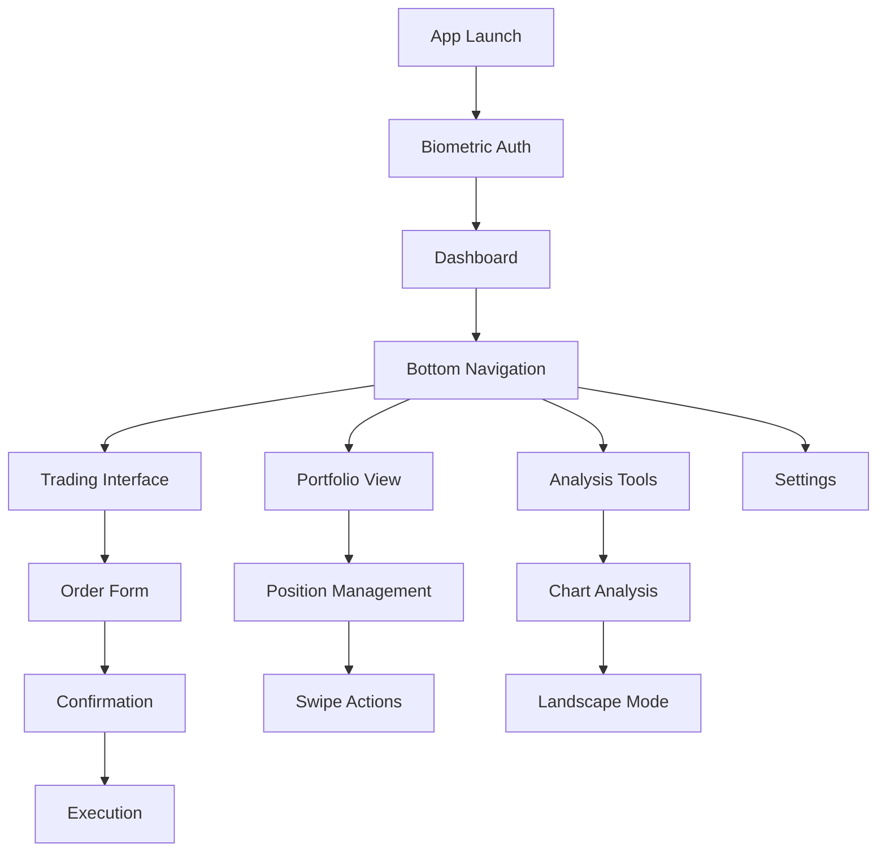

# Mobile Optimization Requirements Document

## 1. Product Overview
Comprehensive mobile optimization of the NusaNexus trading platform to deliver a seamless, touch-friendly experience across all mobile devices. The optimization focuses on responsive design, intuitive navigation, simplified trading interfaces, and mobile-specific features while maintaining full trading functionality and performance.

## 2. Core Features

### 2.1 User Roles
| Role | Mobile Access | Core Mobile Permissions |
|------|---------------|------------------------|
| Trader | Full mobile access | Complete trading functionality, portfolio management, real-time data |
| Analyst | Mobile dashboard access | Market analysis, chart viewing, research tools |
| Administrator | Limited mobile access | User management, system monitoring, basic configuration |

### 2.2 Feature Module
Our mobile optimization requirements consist of the following main areas:
1. **Responsive Design System**: Mobile-first approach with breakpoint strategy and touch-friendly interfaces
2. **Mobile Navigation**: Bottom tab navigation, hamburger menu, swipeable tabs, and floating action buttons
3. **Mobile Trading Interface**: Simplified order forms, large buttons, swipe actions, and landscape chart viewing
4. **Mobile-Specific Features**: Haptic feedback, biometric authentication, offline mode, and background alerts
5. **Performance Optimization**: Lazy loading, image optimization, battery usage optimization, and data minimization
6. **PWA Implementation**: App-like experience with offline capabilities and native device integration
7. **Mobile Testing Framework**: Cross-device testing, gesture validation, and platform-specific considerations

### 2.3 Page Details
| Page Name | Module Name | Feature Description |
|-----------|-------------|--------------------|
| Responsive Design System | Breakpoint Strategy | Implement sm: 640px, md: 768px, lg: 1024px breakpoints with mobile-first CSS approach |
| Responsive Design System | Touch Interface | Create touch-friendly elements with minimum 44px tap targets and proper spacing for thumb navigation |
| Responsive Design System | Swipe Gestures | Implement swipe navigation for charts, tabs, and content areas with visual feedback |
| Mobile Navigation | Bottom Tab Bar | Create persistent bottom navigation with 4-5 main sections (Dashboard, Trading, Portfolio, Analysis, Settings) |
| Mobile Navigation | Hamburger Menu | Implement collapsible side menu for secondary options and account management |
| Mobile Navigation | Swipeable Tabs | Add horizontal swipe navigation for chart timeframes and analysis tools |
| Mobile Navigation | Floating Action Button | Create context-aware FAB for quick actions (new order, position close, alerts) |
| Mobile Trading Interface | Simplified Order Forms | Design streamlined buy/sell forms with large input fields and clear action buttons |
| Mobile Trading Interface | Touch-Friendly Controls | Implement large buttons (minimum 48px height) with clear visual states and haptic feedback |
| Mobile Trading Interface | Swipe Actions | Add swipe-to-close for positions and swipe-to-modify for pending orders |
| Mobile Trading Interface | Pull-to-Refresh | Implement pull-to-refresh for real-time data updates across all trading screens |
| Mobile Trading Interface | Landscape Chart Mode | Optimize chart viewing in landscape orientation with full-screen capabilities |
| Mobile-Specific Features | Haptic Feedback | Integrate vibration feedback for order execution, alerts, and critical actions |
| Mobile-Specific Features | Biometric Authentication | Support fingerprint and face recognition for secure app access |
| Mobile-Specific Features | Offline Mode | Cache essential data and enable basic functionality without internet connection |
| Mobile-Specific Features | Background Alerts | Implement push notifications for price alerts, order fills, and margin calls |
| Mobile-Specific Features | Quick Shortcuts | Create widget-like shortcuts for instant position closing and emergency actions |
| Performance Optimization | Lazy Loading | Implement progressive loading for charts, news feeds, and historical data |
| Performance Optimization | Image Optimization | Use WebP format, responsive images, and compression for all visual assets |
| Performance Optimization | Animation Optimization | Reduce animation complexity and use CSS transforms for better performance |
| Performance Optimization | Battery Optimization | Minimize background processes and optimize WebSocket connections |
| Performance Optimization | Data Minimization | Implement data compression and selective loading based on user preferences |
| PWA Implementation | Service Worker | Create service worker for offline functionality and background sync |
| PWA Implementation | App Manifest | Configure web app manifest for native app-like installation and behavior |
| PWA Implementation | Native Integration | Integrate with device features (camera, notifications, file system) |
| Mobile Testing | Gesture Testing | Validate touch gestures, swipe actions, and multi-touch interactions |
| Mobile Testing | Device Compatibility | Test across various screen sizes, resolutions, and device orientations |
| Mobile Testing | Platform Testing | Ensure compatibility with iOS Safari, Android Chrome, and other mobile browsers |

## 3. Core Process

### Mobile User Flow
1. **App Launch**: User opens PWA or web app → Biometric authentication → Dashboard loads with cached data
2. **Navigation**: User navigates via bottom tabs → Swipe between sections → Access secondary features via hamburger menu
3. **Trading**: User initiates trade via FAB → Simplified order form → Touch-friendly controls → Haptic confirmation → Real-time updates
4. **Analysis**: User views charts → Landscape mode for detailed analysis → Swipe between timeframes → Pull-to-refresh for updates
5. **Portfolio Management**: User reviews positions → Swipe actions for quick modifications → Background alerts for important changes

## 4. User Interface Design

### 4.1 Design Style
- **Primary Colors**: Deep blue (#1e40af) for primary actions, green (#10b981) for buy orders, red (#ef4444) for sell orders
- **Secondary Colors**: Gray scale (#f8fafc to #1e293b) for backgrounds and text hierarchy
- **Button Style**: Rounded corners (8px), elevated shadows, clear visual states (normal, pressed, disabled)
- **Typography**: System fonts (SF Pro on iOS, Roboto on Android) with minimum 16px for body text, 14px for labels
- **Layout Style**: Card-based design with 16px padding, bottom-sheet modals, and floating elements
- **Icons**: Outline style icons with 24px minimum size, filled variants for active states
- **Touch Targets**: Minimum 44px height for all interactive elements with 8px spacing between targets

### 4.2 Page Design Overview
| Page Name | Module Name | UI Elements |
|-----------|-------------|-------------|
| Bottom Navigation | Tab Bar | Fixed bottom bar with 5 tabs, active state indicators, badge notifications for alerts |
| Trading Interface | Order Form | Large input fields, stepper controls for quantity, prominent buy/sell buttons with color coding |
| Chart Analysis | Landscape Mode | Full-screen charts, floating controls, gesture-based zoom and pan, timeframe selector |
| Portfolio View | Position Cards | Swipeable cards with P&L indicators, quick action buttons, pull-to-refresh header |
| Settings Menu | Mobile Layout | Grouped settings with large touch targets, toggle switches, and clear section dividers |

### 4.3 Responsiveness
**Mobile-First Approach**: Design starts with mobile (320px) and scales up through breakpoints
- **Small Mobile** (320px-639px): Single column layout, bottom navigation, simplified interfaces
- **Large Mobile** (640px-767px): Enhanced spacing, larger touch targets, optional side panels
- **Tablet** (768px-1023px): Two-column layouts, expanded navigation, desktop-like features
- **Desktop** (1024px+): Full desktop experience with mobile optimizations available

**Touch Optimization**: All interactive elements optimized for finger navigation with proper spacing and visual feedback
**Orientation Support**: Seamless transition between portrait and landscape modes with optimized layouts for each orientation