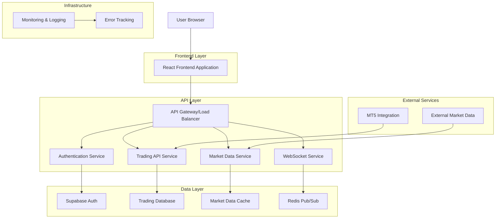
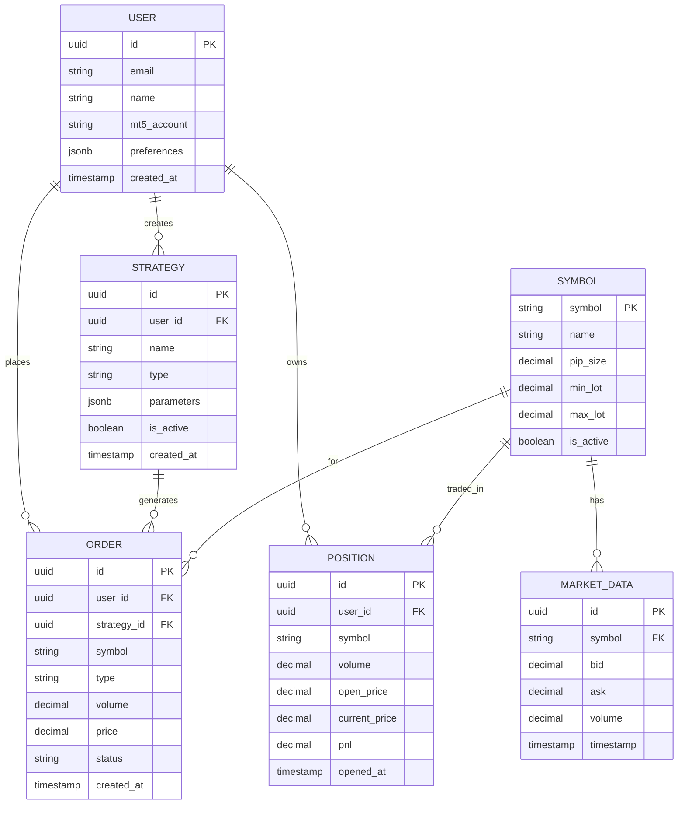
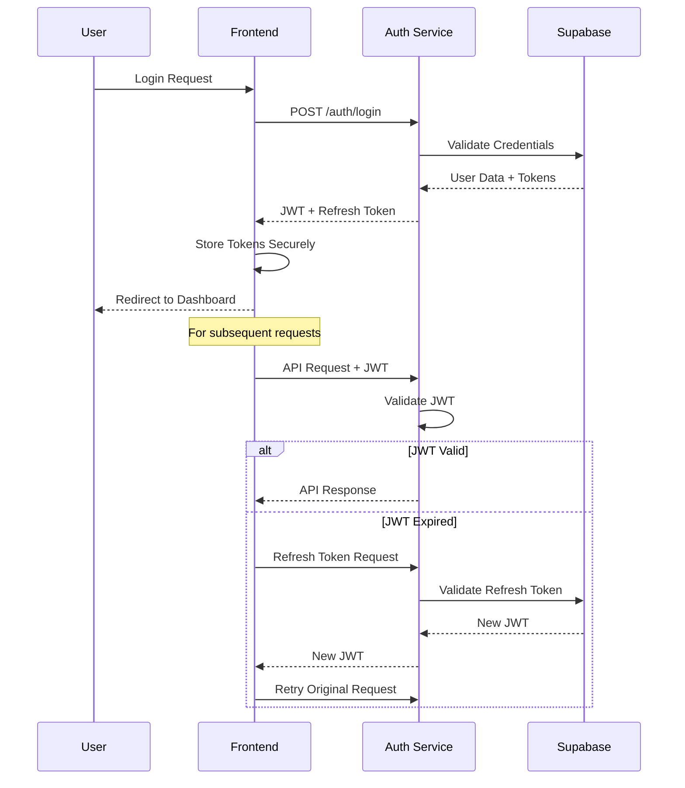

# Production Readiness Architecture - NusaNexus Trading Platform

## 1. Architecture Overview



## 2. Technology Stack

### Frontend Stack
- **Framework**: React@18 + TypeScript@5
- **Build Tool**: Vite@5
- **Styling**: TailwindCSS@3 + Headless UI
- **State Management**: Zustand@5
- **Data Fetching**: TanStack Query@5
- **Charts**: Lightweight Charts + Recharts
- **Real-time**: Socket.IO Client@4
- **Authentication**: Supabase Auth
- **PWA**: Workbox + Vite PWA Plugin

### Backend Integration
- **API Client**: Axios with interceptors
- **WebSocket**: Socket.IO for real-time data
- **Authentication**: JWT + Refresh Token
- **Caching**: React Query + Service Worker
- **Error Handling**: React Error Boundaries + Sentry

## 3. Route Definitions

| Route | Purpose | Authentication Required |
|-------|---------|------------------------|
| / | Landing page redirect to dashboard | No |
| /dashboard | Main trading dashboard | Yes |
| /trading | Live trading interface | Yes |
| /strategies | Strategy management | Yes |
| /portfolio | Portfolio overview | Yes |
| /settings | User settings and configuration | Yes |
| /ai-analysis | AI market analysis dashboard | Yes |
| /mobile-test | Mobile testing interface | No (Dev only) |
| /login | User authentication | No |
| /register | User registration | No |
| /forgot-password | Password recovery | No |

## 4. API Integration Architecture

### 4.1 Core API Endpoints

**Authentication APIs**
```typescript
POST /api/auth/login
POST /api/auth/register
POST /api/auth/refresh
POST /api/auth/logout
GET /api/auth/profile
```

**Trading APIs**
```typescript
GET /api/trading/positions
POST /api/trading/orders
PUT /api/trading/orders/:id
DELETE /api/trading/orders/:id
GET /api/trading/history
```

**Market Data APIs**
```typescript
GET /api/market/symbols
GET /api/market/prices/:symbol
GET /api/market/history/:symbol
GET /api/market/news
```

**Strategy APIs**
```typescript
GET /api/strategies
POST /api/strategies
PUT /api/strategies/:id
DELETE /api/strategies/:id
POST /api/strategies/:id/execute
```

**AI Analysis APIs**
```typescript
GET /api/ai/analysis/:symbol
POST /api/ai/recommendations
GET /api/ai/insights
POST /api/ai/strategy-generate
```

### 4.2 WebSocket Events

**Market Data Events**
```typescript
// Incoming events
'price_update' | 'market_status' | 'news_update'

// Outgoing events
'subscribe_symbol' | 'unsubscribe_symbol' | 'heartbeat'
```

**Trading Events**
```typescript
// Incoming events
'position_update' | 'order_filled' | 'balance_update'

// Outgoing events
'place_order' | 'cancel_order' | 'modify_order'
```

## 5. Data Models

### 5.1 Core Entities



### 5.2 Frontend State Models

```typescript
// User State
interface UserState {
  user: User | null;
  isAuthenticated: boolean;
  preferences: UserPreferences;
  login: (credentials: LoginCredentials) => Promise<void>;
  logout: () => void;
}

// Trading State
interface TradingState {
  positions: Position[];
  orders: Order[];
  selectedSymbol: string;
  marketData: Record<string, MarketData>;
  placeOrder: (order: OrderRequest) => Promise<void>;
  cancelOrder: (orderId: string) => Promise<void>;
}

// Strategy State
interface StrategyState {
  strategies: Strategy[];
  activeStrategies: string[];
  selectedStrategy: Strategy | null;
  createStrategy: (strategy: CreateStrategyRequest) => Promise<void>;
  executeStrategy: (strategyId: string) => Promise<void>;
}
```

## 6. Security Architecture

### 6.1 Authentication Flow



### 6.2 Security Measures

- **JWT Token Management**: Secure storage with automatic refresh
- **API Security**: CORS, rate limiting, input validation
- **Data Encryption**: Sensitive data encrypted at rest
- **HTTPS Only**: All communications over secure channels
- **CSP Headers**: Content Security Policy implementation
- **XSS Protection**: Input sanitization and output encoding

## 7. Performance Optimization

### 7.1 Frontend Optimization

```typescript
// Code Splitting Strategy
const Dashboard = lazy(() => import('./pages/Dashboard'));
const Trading = lazy(() => import('./pages/Trading'));
const Strategies = lazy(() => import('./pages/Strategies'));

// Bundle Analysis Target
{
  "main": "< 500KB",
  "vendor": "< 800KB",
  "chunks": "< 200KB each"
}
```

### 7.2 Caching Strategy

- **Static Assets**: CDN caching with versioning
- **API Responses**: React Query with stale-while-revalidate
- **Market Data**: Service Worker caching with TTL
- **User Preferences**: Local Storage with sync

### 7.3 Real-time Data Optimization

```typescript
// WebSocket Message Throttling
const throttledPriceUpdate = throttle((data: PriceUpdate) => {
  updateMarketData(data);
}, 100); // Max 10 updates per second

// Selective Subscriptions
const subscribeToSymbol = (symbol: string) => {
  if (!activeSubscriptions.has(symbol)) {
    websocket.emit('subscribe', { symbol, type: 'price' });
    activeSubscriptions.add(symbol);
  }
};
```

## 8. Error Handling & Monitoring

### 8.1 Error Boundaries

```typescript
// Global Error Boundary
class GlobalErrorBoundary extends Component {
  componentDidCatch(error: Error, errorInfo: ErrorInfo) {
    // Log to monitoring service
    Sentry.captureException(error, {
      contexts: { errorInfo },
      tags: { component: 'global' }
    });
  }
}

// Trading-specific Error Boundary
class TradingErrorBoundary extends Component {
  componentDidCatch(error: Error, errorInfo: ErrorInfo) {
    // Critical trading errors
    Sentry.captureException(error, {
      level: 'fatal',
      tags: { component: 'trading' }
    });
    
    // Notify user immediately
    toast.error('Trading system error. Please refresh.');
  }
}
```

### 8.2 Monitoring Setup

```typescript
// Performance Monitoring
const performanceMonitor = {
  trackPageLoad: (pageName: string) => {
    const navigation = performance.getEntriesByType('navigation')[0];
    Sentry.addBreadcrumb({
      message: `Page loaded: ${pageName}`,
      data: { loadTime: navigation.loadEventEnd - navigation.loadEventStart }
    });
  },
  
  trackApiCall: (endpoint: string, duration: number, status: number) => {
    if (duration > 5000 || status >= 400) {
      Sentry.captureMessage(`Slow/Failed API call: ${endpoint}`, {
        level: status >= 400 ? 'error' : 'warning',
        extra: { duration, status }
      });
    }
  }
};
```

## 9. Deployment Architecture

### 9.1 Build Configuration

```typescript
// vite.config.ts - Production
export default defineConfig({
  build: {
    target: 'es2020',
    sourcemap: 'hidden',
    rollupOptions: {
      output: {
        manualChunks: {
          vendor: ['react', 'react-dom'],
          charts: ['lightweight-charts', 'recharts'],
          ui: ['@headlessui/react', 'framer-motion']
        }
      }
    },
    chunkSizeWarningLimit: 1000
  },
  define: {
    __APP_VERSION__: JSON.stringify(process.env.npm_package_version)
  }
});
```

### 9.2 Environment Configuration

```bash
# Production Environment Variables
VITE_API_BASE_URL=https://api.nusanexus.com
VITE_WS_URL=wss://ws.nusanexus.com
VITE_SUPABASE_URL=https://your-project.supabase.co
VITE_SUPABASE_ANON_KEY=your-anon-key
VITE_SENTRY_DSN=your-sentry-dsn
VITE_APP_ENV=production
```

### 9.3 CI/CD Pipeline

```yaml
# .github/workflows/deploy.yml
name: Deploy to Production
on:
  push:
    branches: [main]

jobs:
  test:
    runs-on: ubuntu-latest
    steps:
      - uses: actions/checkout@v3
      - name: Setup Node.js
        uses: actions/setup-node@v3
        with:
          node-version: '18'
      - name: Install dependencies
        run: npm ci
      - name: Run tests
        run: npm run test
      - name: Type check
        run: npm run check
      - name: Lint
        run: npm run lint
  
  build:
    needs: test
    runs-on: ubuntu-latest
    steps:
      - uses: actions/checkout@v3
      - name: Build application
        run: npm run build
      - name: Deploy to Netlify
        uses: netlify/actions/deploy@master
        with:
          publish-dir: './dist'
          production-branch: main
```

## 10. Testing Strategy

### 10.1 Testing Pyramid

```typescript
// Unit Tests (70%)
describe('TradingStore', () => {
  it('should place order correctly', async () => {
    const store = useTradingStore.getState();
    await store.placeOrder(mockOrder);
    expect(store.orders).toContain(mockOrder);
  });
});

// Integration Tests (20%)
describe('Trading Flow', () => {
  it('should complete order placement flow', async () => {
    render(<TradingInterface />);
    fireEvent.click(screen.getByText('Buy'));
    await waitFor(() => {
      expect(screen.getByText('Order Placed')).toBeInTheDocument();
    });
  });
});

// E2E Tests (10%)
describe('User Journey', () => {
  it('should allow user to login and place trade', async () => {
    await page.goto('/login');
    await page.fill('[data-testid="email"]', 'test@example.com');
    await page.fill('[data-testid="password"]', 'password');
    await page.click('[data-testid="login-button"]');
    await expect(page).toHaveURL('/dashboard');
  });
});
```

## 11. Mobile Optimization

### 11.1 PWA Configuration

```typescript
// PWA Manifest
{
  "name": "NusaNexus Trading Platform",
  "short_name": "NusaNexus",
  "theme_color": "#1f2937",
  "background_color": "#ffffff",
  "display": "standalone",
  "orientation": "portrait",
  "scope": "/",
  "start_url": "/dashboard",
  "icons": [
    {
      "src": "icons/icon-192x192.png",
      "sizes": "192x192",
      "type": "image/png"
    }
  ]
}
```

### 11.2 Touch Optimization

```typescript
// Touch-friendly Trading Controls
const TradingButton = ({ action, onTrade }) => {
  const [isPressed, setIsPressed] = useState(false);
  
  return (
    <motion.button
      className="min-h-[48px] min-w-[48px] touch-manipulation"
      onTouchStart={() => setIsPressed(true)}
      onTouchEnd={() => setIsPressed(false)}
      whileTap={{ scale: 0.95 }}
      onClick={onTrade}
    >
      {action}
    </motion.button>
  );
};
```

## 12. Success Metrics & KPIs

### 12.1 Technical Metrics
- **Performance**: First Contentful Paint < 1.5s
- **Reliability**: Uptime > 99.9%
- **Security**: Zero critical vulnerabilities
- **Quality**: Test coverage > 80%

### 12.2 User Experience Metrics
- **Accessibility**: WCAG 2.1 AA compliance
- **Mobile**: Core Web Vitals passing
- **Error Rate**: < 0.1% of user sessions
- **Load Time**: 95th percentile < 3s

This architecture provides a comprehensive foundation for production deployment while maintaining scalability, security, and performance standards required for a trading platform.