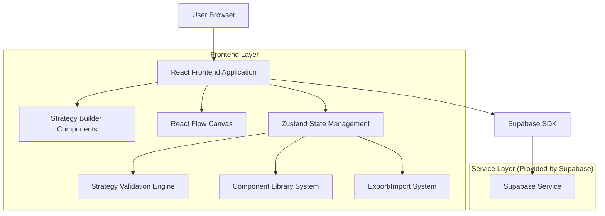
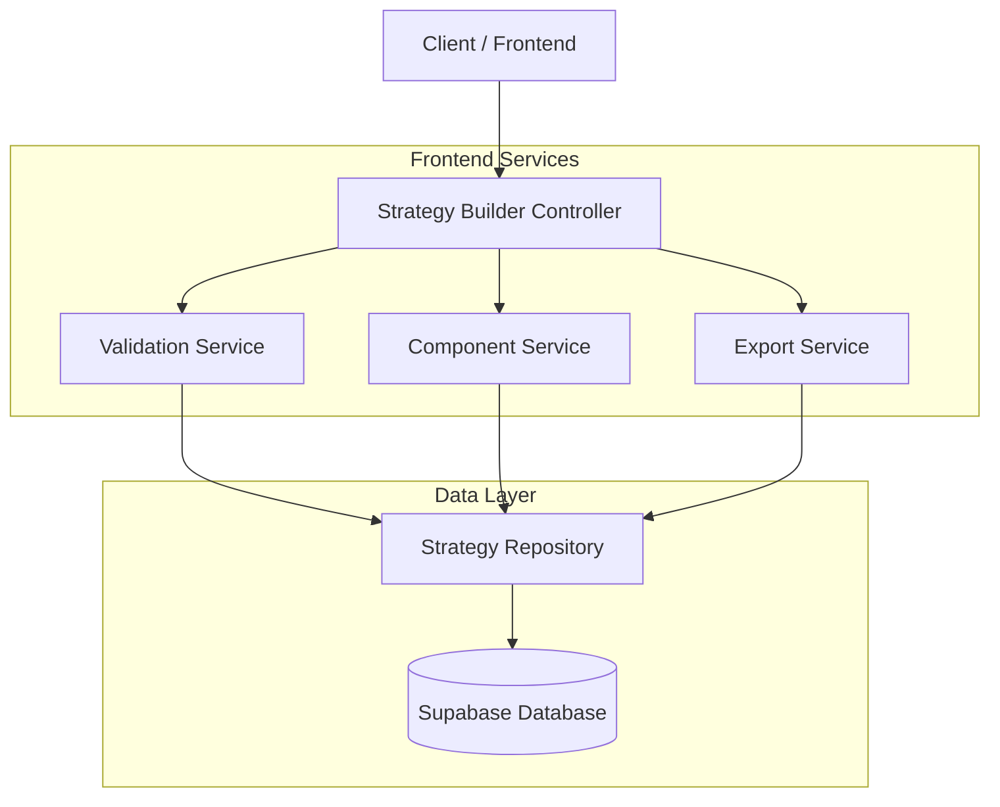
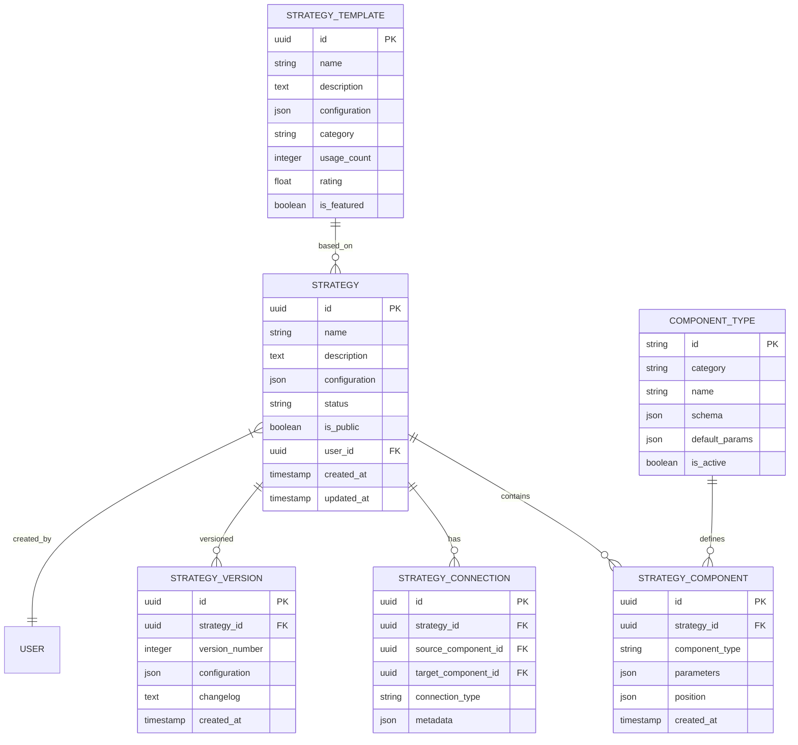

# Strategy Builder - Technical Architecture Document

## 1. Architecture Design



## 2. Technology Description

* Frontend: React\@18 + TypeScript + Tailwind CSS + Vite

* Visual Flow: React Flow\@11 + React DnD\@16

* State Management: Zustand\@4 + Immer\@10

* UI Components: Radix UI + Lucide React

* Validation: Zod\@3 + React Hook Form\@7

* Backend: Supabase (Authentication, Database, Storage)

## 3. Route Definitions

| Route                   | Purpose                                       |
| ----------------------- | --------------------------------------------- |
| /strategies             | Strategy library and management dashboard     |
| /strategies/builder     | Main drag-and-drop strategy builder interface |
| /strategies/builder/:id | Edit existing strategy                        |
| /strategies/testing/:id | Strategy backtesting and optimization         |
| /strategies/templates   | Browse and manage strategy templates          |
| /strategies/shared/:id  | View shared public strategies                 |

## 4. API Definitions

### 4.1 Core API

Strategy management endpoints:

```
GET /api/strategies
POST /api/strategies
PUT /api/strategies/:id
DELETE /api/strategies/:id
```

Strategy validation:

```
POST /api/strategies/validate
```

Request:

| Param Name  | Param Type       | isRequired | Description                      |
| ----------- | ---------------- | ---------- | -------------------------------- |
| strategy    | StrategyConfig   | true       | Complete strategy configuration  |
| components  | ComponentNode\[] | true       | Array of strategy components     |
| connections | Connection\[]    | true       | Component connection definitions |

Response:

| Param Name   | Param Type           | Description                         |
| ------------ | -------------------- | ----------------------------------- |
| isValid      | boolean              | Overall validation status           |
| errors       | ValidationError\[]   | Array of validation errors          |
| warnings     | ValidationWarning\[] | Array of warnings                   |
| completeness | number               | Strategy completeness score (0-100) |

Example:

```json
{
  "strategy": {
    "name": "MA Cross Strategy",
    "description": "Simple moving average crossover",
    "timeframe": "H1",
    "components": [...],
    "connections": [...]
  }
}
```

## 5. Server Architecture Diagram



## 6. Data Model

### 6.1 Data Model Definition



### 6.2 Data Definition Language

Strategy Table (strategies):

```sql
-- Create strategies table
CREATE TABLE strategies (
    id UUID PRIMARY KEY DEFAULT gen_random_uuid(),
    name VARCHAR(255) NOT NULL,
    description TEXT,
    configuration JSONB NOT NULL,
    status VARCHAR(20) DEFAULT 'draft' CHECK (status IN ('draft', 'active', 'archived')),
    is_public BOOLEAN DEFAULT false,
    user_id UUID NOT NULL,
    created_at TIMESTAMP WITH TIME ZONE DEFAULT NOW(),
    updated_at TIMESTAMP WITH TIME ZONE DEFAULT NOW()
);

-- Create strategy components table
CREATE TABLE strategy_components (
    id UUID PRIMARY KEY DEFAULT gen_random_uuid(),
    strategy_id UUID NOT NULL REFERENCES strategies(id) ON DELETE CASCADE,
    component_type VARCHAR(100) NOT NULL,
    parameters JSONB NOT NULL DEFAULT '{}',
    position JSONB NOT NULL DEFAULT '{"x": 0, "y": 0}',
    created_at TIMESTAMP WITH TIME ZONE DEFAULT NOW()
);

-- Create strategy connections table
CREATE TABLE strategy_connections (
    id UUID PRIMARY KEY DEFAULT gen_random_uuid(),
    strategy_id UUID NOT NULL REFERENCES strategies(id) ON DELETE CASCADE,
    source_component_id UUID NOT NULL REFERENCES strategy_components(id) ON DELETE CASCADE,
    target_component_id UUID NOT NULL REFERENCES strategy_components(id) ON DELETE CASCADE,
    connection_type VARCHAR(50) NOT NULL DEFAULT 'flow',
    metadata JSONB DEFAULT '{}'
);

-- Create component types table
CREATE TABLE component_types (
    id VARCHAR(100) PRIMARY KEY,
    category VARCHAR(50) NOT NULL,
    name VARCHAR(255) NOT NULL,
    schema JSONB NOT NULL,
    default_params JSONB NOT NULL DEFAULT '{}',
    is_active BOOLEAN DEFAULT true
);

-- Create strategy versions table
CREATE TABLE strategy_versions (
    id UUID PRIMARY KEY DEFAULT gen_random_uuid(),
    strategy_id UUID NOT NULL REFERENCES strategies(id) ON DELETE CASCADE,
    version_number INTEGER NOT NULL,
    configuration JSONB NOT NULL,
    changelog TEXT,
    created_at TIMESTAMP WITH TIME ZONE DEFAULT NOW(),
    UNIQUE(strategy_id, version_number)
);

-- Create strategy templates table
CREATE TABLE strategy_templates (
    id UUID PRIMARY KEY DEFAULT gen_random_uuid(),
    name VARCHAR(255) NOT NULL,
    description TEXT,
    configuration JSONB NOT NULL,
    category VARCHAR(50) NOT NULL,
    usage_count INTEGER DEFAULT 0,
    rating DECIMAL(3,2) DEFAULT 0.0,
    is_featured BOOLEAN DEFAULT false,
    created_at TIMESTAMP WITH TIME ZONE DEFAULT NOW()
);

-- Create indexes
CREATE INDEX idx_strategies_user_id ON strategies(user_id);
CREATE INDEX idx_strategies_status ON strategies(status);
CREATE INDEX idx_strategies_is_public ON strategies(is_public);
CREATE INDEX idx_strategy_components_strategy_id ON strategy_components(strategy_id);
CREATE INDEX idx_strategy_connections_strategy_id ON strategy_connections(strategy_id);
CREATE INDEX idx_component_types_category ON component_types(category);
CREATE INDEX idx_strategy_templates_category ON strategy_templates(category);
CREATE INDEX idx_strategy_templates_featured ON strategy_templates(is_featured);

-- Grant permissions
GRANT SELECT ON strategies TO anon;
GRANT ALL PRIVILEGES ON strategies TO authenticated;
GRANT SELECT ON strategy_components TO anon;
GRANT ALL PRIVILEGES ON strategy_components TO authenticated;
GRANT SELECT ON strategy_connections TO anon;
GRANT ALL PRIVILEGES ON strategy_connections TO authenticated;
GRANT SELECT ON component_types TO anon;
GRANT ALL PRIVILEGES ON component_types TO authenticated;
GRANT SELECT ON strategy_versions TO anon;
GRANT ALL PRIVILEGES ON strategy_versions TO authenticated;
GRANT SELECT ON strategy_templates TO anon;
GRANT ALL PRIVILEGES ON strategy_templates TO authenticated;

-- Insert initial component types
INSERT INTO component_types (id, category, name, schema, default_params) VALUES
('ma_cross', 'entry_conditions', 'Moving Average Cross', 
 '{"type": "object", "properties": {"fast_period": {"type": "number", "minimum": 1, "maximum": 200}, "slow_period": {"type": "number", "minimum": 1, "maximum": 200}, "ma_type": {"type": "string", "enum": ["SMA", "EMA"]}}}',
 '{"fast_period": 10, "slow_period": 20, "ma_type": "SMA"}'),

('rsi_level', 'entry_conditions', 'RSI Level', 
 '{"type": "object", "properties": {"period": {"type": "number", "minimum": 2, "maximum": 100}, "overbought": {"type": "number", "minimum": 50, "maximum": 100}, "oversold": {"type": "number", "minimum": 0, "maximum": 50}}}',
 '{"period": 14, "overbought": 70, "oversold": 30}'),

('take_profit', 'exit_conditions', 'Take Profit', 
 '{"type": "object", "properties": {"type": {"type": "string", "enum": ["pips", "percentage", "ratio"]}, "value": {"type": "number", "minimum": 0}}}',
 '{"type": "pips", "value": 50}'),

('stop_loss', 'exit_conditions', 'Stop Loss', 
 '{"type": "object", "properties": {"type": {"type": "string", "enum": ["pips", "percentage", "atr"]}, "value": {"type": "number", "minimum": 0}}}',
 '{"type": "pips", "value": 25}'),

('position_size', 'risk_management', 'Position Sizing', 
 '{"type": "object", "properties": {"type": {"type": "string", "enum": ["fixed", "percentage", "kelly"]}, "value": {"type": "number", "minimum": 0}}}',
 '{"type": "percentage", "value": 2}'),

('trading_hours', 'time_filters', 'Trading Hours', 
 '{"type": "object", "properties": {"start_hour": {"type": "number", "minimum": 0, "maximum": 23}, "end_hour": {"type": "number", "minimum": 0, "maximum": 23}, "timezone": {"type": "string"}}}',
 '{"start_hour": 8, "end_hour": 17, "timezone": "UTC"}');

-- Insert sample strategy templates
INSERT INTO strategy_templates (name, description, configuration, category, is_featured) VALUES
('Simple MA Cross', 'Basic moving average crossover strategy with risk management', 
 '{"components": [{"type": "ma_cross", "params": {"fast_period": 10, "slow_period": 20}}, {"type": "take_profit", "params": {"type": "pips", "value": 50}}, {"type": "stop_loss", "params": {"type": "pips", "value": 25}}]}',
 'trend_following', true),

('RSI Mean Reversion', 'RSI-based mean reversion strategy with time filters', 
 '{"components": [{"type": "rsi_level", "params": {"period": 14, "overbought": 80, "oversold": 20}}, {"type": "trading_hours", "params": {"start_hour": 8, "end_hour": 16}}]}',
 'mean_reversion', true);
```

## 7. Component Architecture

### 7.1 React Flow Integration

* Custom node types for each component category

* Custom edge types for different connection types

* Node positioning and layout algorithms

* Zoom and pan controls with minimap

* Keyboard shortcuts for common operations

### 7.2 State Management Structure

```typescript
interface StrategyBuilderStore {
  // Strategy state
  currentStrategy: Strategy | null;
  components: ComponentNode[];
  connections: Connection[];
  
  // UI state
  selectedComponent: string | null;
  draggedComponent: ComponentType | null;
  validationResults: ValidationResult[];
  
  // Actions
  addComponent: (type: string, position: Position) => void;
  removeComponent: (id: string) => void;
  updateComponent: (id: string, params: any) => void;
  addConnection: (source: string, target: string) => void;
  validateStrategy: () => Promise<ValidationResult>;
}
```

### 7.3 Component Library System

* Dynamic component registration

* Category-based organization

* Search and filtering capabilities

* Component preview and documentation

* Drag-and-drop integration with React DnD

### 7.4 Validation Engine

* Real-time validation during editing

* Rule-based validation system

* Async validation for complex rules

* Visual feedback integration

* Completeness scoring algorithm

