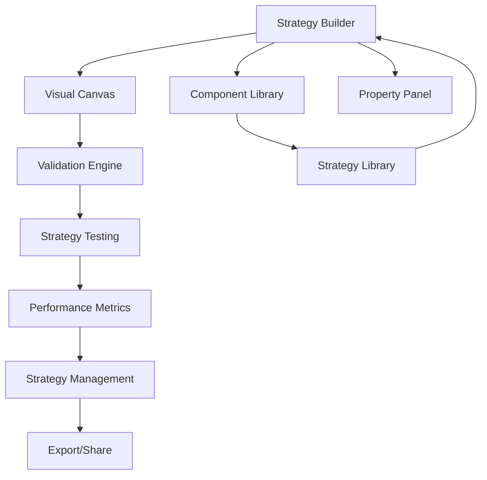

# Strategy Builder - Product Requirements Document

## 1. Product Overview

A visual drag-and-drop strategy builder that enables traders to create, validate, and test trading strategies through an intuitive interface without coding knowledge.
The system integrates with the existing NusaNexus trading platform to provide seamless strategy creation, backtesting, and deployment capabilities.
Target market includes retail traders, strategy developers, and trading educators seeking efficient strategy prototyping and validation tools.

## 2. Core Features

### 2.1 User Roles

| Role               | Registration Method      | Core Permissions                           |
| ------------------ | ------------------------ | ------------------------------------------ |
| Strategy Creator   | Platform registration    | Create, edit, test private strategies      |
| Strategy Publisher | Verified account upgrade | Publish strategies, access analytics       |
| Strategy Consumer  | Basic registration       | Browse, copy, and modify public strategies |

### 2.2 Feature Module

Our strategy builder requirements consist of the following main pages:

1. **Strategy Builder**: Component library, visual canvas, property panel, validation system
2. **Strategy Library**: Browse templates, public strategies, personal collection
3. **Strategy Testing**: Backtesting interface, performance metrics, optimization tools
4. **Strategy Management**: Save, export, share, version control

### 2.3 Page Details

| Page Name           | Module Name           | Feature description                                                                                                        |
| ------------------- | --------------------- | -------------------------------------------------------------------------------------------------------------------------- |
| Strategy Builder    | Component Library     | Display categorized draggable components (Entry/Exit Conditions, Risk Management, Time Filters) with search and filtering  |
| Strategy Builder    | Visual Canvas         | React Flow-based drag-drop interface with connection lines, zoom/pan, component positioning, real-time validation feedback |
| Strategy Builder    | Property Panel        | Dynamic form for selected component configuration, parameter validation, help documentation                                |
| Strategy Builder    | Validation Engine     | Real-time logic flow validation, completeness scoring, conflict detection, required component checking                     |
| Strategy Library    | Template Browser      | Browse pre-built strategy templates by category, popularity, performance metrics                                           |
| Strategy Library    | Public Strategies     | Discover community strategies with ratings, comments, performance data                                                     |
| Strategy Library    | Personal Collection   | Manage saved strategies, folders, tags, sharing settings                                                                   |
| Strategy Testing    | Backtesting Interface | Configure test parameters, historical data selection, performance visualization                                            |
| Strategy Testing    | Optimization Tools    | Parameter sweep, genetic algorithm optimization, sensitivity analysis                                                      |
| Strategy Testing    | Risk Assessment       | Drawdown analysis, risk metrics, Monte Carlo simulation                                                                    |
| Strategy Management | Export System         | JSON export, backtesting engine integration, strategy description generation                                               |
| Strategy Management | Sharing Features      | Public/private sharing, collaboration tools, version history                                                               |

## 3. Core Process

**Strategy Creation Flow:**
User accesses Strategy Builder → Drags components from library to canvas → Connects components with flow lines → Configures component properties → Validates strategy logic → Tests with sample data → Saves or exports strategy

**Strategy Testing Flow:**
User selects strategy → Configures backtesting parameters → Runs historical simulation → Reviews performance metrics → Optimizes parameters → Saves optimized version

**Strategy Sharing Flow:**
User creates strategy → Sets sharing permissions → Publishes to community → Other users discover and clone → Original creator receives analytics

## 4. User Interface Design

### 4.1 Design Style

* Primary colors: Blue (#3B82F6) for actions, Green (#10B981) for success states

* Secondary colors: Gray (#6B7280) for neutral elements, Red (#EF4444) for warnings

* Button style: Rounded corners (8px), subtle shadows, hover animations

* Font: Inter font family, 14px base size, 16px for headings

* Layout style: Three-panel layout with resizable dividers, dark theme optimized

* Icons: Lucide React icons for consistency, 16px standard size

### 4.2 Page Design Overview

| Page Name        | Module Name           | UI Elements                                                                            |
| ---------------- | --------------------- | -------------------------------------------------------------------------------------- |
| Strategy Builder | Component Library     | Collapsible categories, drag handles, component previews, search bar with dark styling |
| Strategy Builder | Visual Canvas         | Grid background, connection ports, selection highlights, zoom controls, minimap        |
| Strategy Builder | Property Panel        | Dynamic forms, validation indicators, help tooltips, parameter sliders                 |
| Strategy Testing | Backtesting Interface | Chart visualizations, metric cards, progress indicators, parameter grids               |
| Strategy Library | Template Browser      | Card-based layout, filter sidebar, performance badges, preview modals                  |

### 4.3 Responsiveness

Desktop-first design with tablet adaptation for canvas interactions. Touch-optimized drag-and-drop for tablet users with larger touch targets and gesture support.

## 5. Component Types Specification

### 5.1 Entry Conditions

* **Moving Average Cross**: SMA/EMA crossover detection with customizable periods

* **RSI Levels**: Overbought/oversold threshold triggers with period configuration

* **Price Action**: Support/resistance breaks, candlestick patterns, price level conditions

* **MACD Signals**: Signal line crosses, histogram conditions, divergence detection

* **Bollinger Bands**: Band touches, squeeze conditions, bandwidth thresholds

### 5.2 Exit Conditions

* **Take Profit**: Fixed pips, percentage, risk-reward ratio configurations

* **Stop Loss**: Fixed pips, percentage, ATR-based dynamic stops

* **Trailing Stop**: Fixed trail, percentage trail, indicator-based trailing

* **Time Exit**: Maximum trade duration, session close, specific time triggers

### 5.3 Risk Management

* **Position Sizing**: Fixed lot, percentage of account, Kelly criterion, volatility-based

* **Maximum Drawdown**: Account percentage limits, consecutive loss limits

* **Daily Limits**: Maximum trades per day, maximum loss per day

* **Correlation Limits**: Maximum correlated positions, currency exposure limits

### 5.4 Time Filters

* **Trading Sessions**: London, New York, Tokyo, Sydney session filters

* **Days of Week**: Weekday/weekend filters, specific day selection

* **Time Ranges**: Custom hour ranges, holiday calendars, news event avoidance

## 6. Validation Requirements

### 6.1 Logic Flow Validation

* Entry condition must be connected to position sizing

* Exit conditions must be properly linked to entry

* Risk management rules must be present and valid

* No circular dependencies in component connections

### 6.2 Parameter Validation

* Numeric ranges within realistic bounds (e.g., RSI 0-100)

* Percentage values between 0-100%

* Time periods greater than 0

* Risk-reward ratios greater than 0

### 6.3 Completeness Scoring

* Entry condition: 25 points

* Exit condition: 25 points

* Risk management: 30 points

* Time filters: 10 points

* Advanced features: 10 points

## 7. Testing and Export Features

### 7.1 Strategy Preview

* Sample trade visualization with current market data

* Component interaction simulation

* Parameter sensitivity preview

* Logic flow verification

### 7.2 Performance Metrics

* Win rate, profit factor, Sharpe ratio

* Maximum drawdown, average trade duration

* Risk-adjusted returns, Calmar ratio

* Monthly/yearly performance breakdown

### 7.3 Export Formats

* JSON configuration for platform integration

* MQL4/MQL5 code generation (future)

* Pine Script export (future)

* Human-readable strategy description

### 7.4 Template System

* Save custom templates with metadata

* Template categories and tags

* Template sharing and rating system

* Template version control and updates

