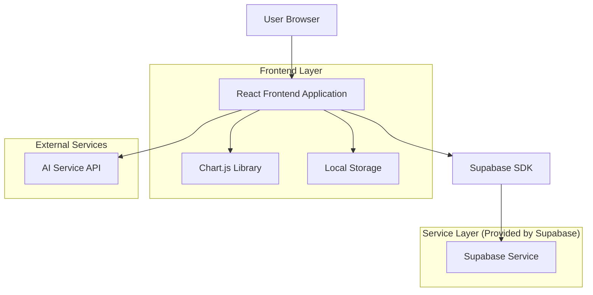
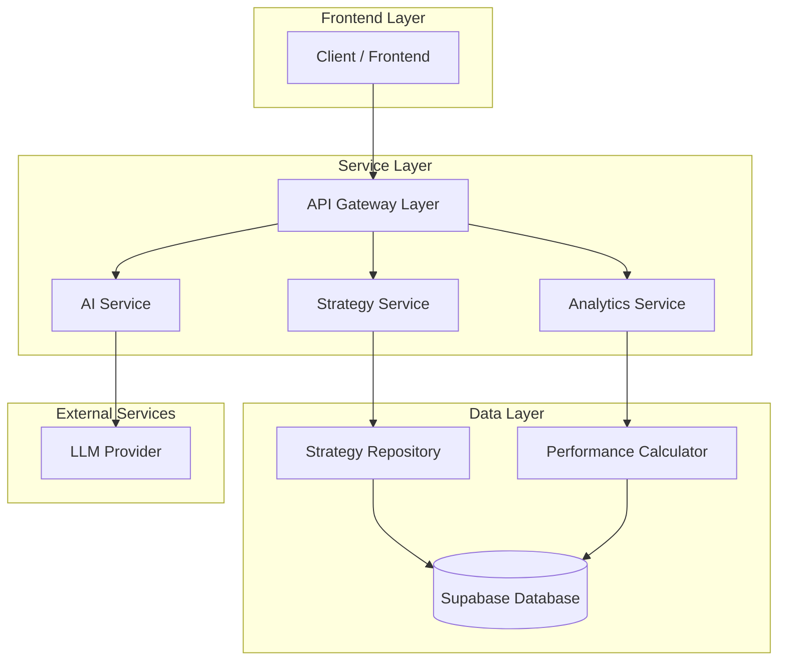
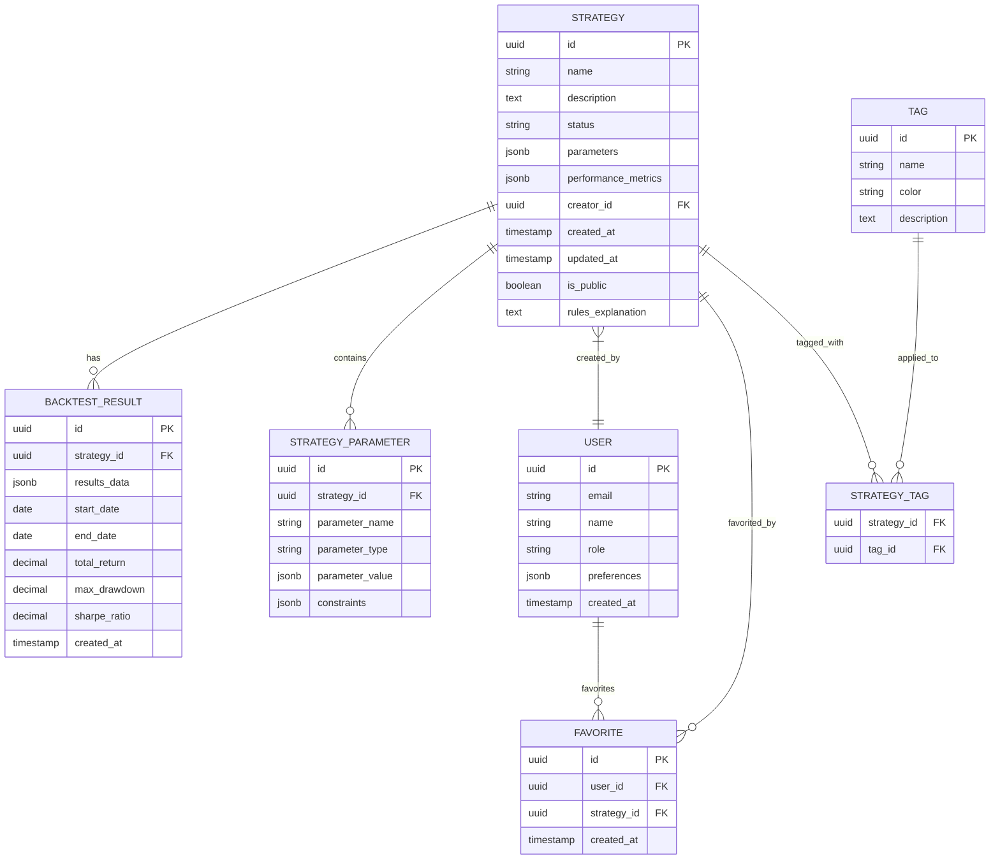

# Strategy Management Interface - Technical Architecture Document

## 1. Architecture Design



## 2. Technology Description

* Frontend: React\@18 + TypeScript + TailwindCSS\@3 + Vite

* Backend: Supabase (Authentication, Database, Real-time subscriptions)

* Charts: Chart.js\@4 + react-chartjs-2

* State Management: Zustand

* UI Components: Custom components + Lucide React icons

* AI Integration: OpenAI API or similar LLM service

## 3. Route Definitions

| Route                   | Purpose                                                   |
| ----------------------- | --------------------------------------------------------- |
| /strategies             | Main strategy library page with grid layout and filtering |
| /strategies/:id         | Individual strategy details view (modal overlay)          |
| /strategies/compare     | Bulk comparison view for selected strategies              |
| /strategies/ai-insights | AI-powered recommendations and market analysis            |
| /strategies/favorites   | User's favorited strategies collection                    |

## 4. API Definitions

### 4.1 Core API

Strategy management related

```
GET /api/strategies
```

Request:

| Param Name | Param Type | isRequired | Description                                |
| ---------- | ---------- | ---------- | ------------------------------------------ |
| page       | number     | false      | Page number for pagination                 |
| limit      | number     | false      | Number of strategies per page              |
| search     | string     | false      | Search term for name/description           |
| status     | string     | false      | Filter by status (active/inactive/testing) |
| sortBy     | string     | false      | Sort field (performance/date/name)         |
| sortOrder  | string     | false      | Sort direction (asc/desc)                  |
| tags       | string\[]  | false      | Filter by category tags                    |

Response:

| Param Name | Param Type  | Description                |
| ---------- | ----------- | -------------------------- |
| strategies | Strategy\[] | Array of strategy objects  |
| totalCount | number      | Total number of strategies |
| hasMore    | boolean     | Whether more pages exist   |

Example Response:

```json
{
  "strategies": [
    {
      "id": "strategy-1",
      "name": "Moving Average Crossover",
      "description": "Simple MA crossover strategy",
      "status": "active",
      "performance": {
        "winRate": 65.5,
        "totalPnL": 1250.75,
        "sharpeRatio": 1.8
      },
      "lastModified": "2024-01-15T10:30:00Z",
      "creator": {
        "name": "John Doe",
        "rating": 4.5
      },
      "tags": ["trend-following", "beginner"]
    }
  ],
  "totalCount": 45,
  "hasMore": true
}
```

Strategy details retrieval

```
GET /api/strategies/:id
```

Response:

| Param Name      | Param Type   | Description                             |
| --------------- | ------------ | --------------------------------------- |
| strategy        | Strategy     | Complete strategy object with analytics |
| backtestResults | BacktestData | Historical performance data             |
| riskMetrics     | RiskMetrics  | Risk analysis and drawdown data         |

Bulk operations

```
POST /api/strategies/bulk
```

Request:

| Param Name  | Param Type | isRequired | Description                                     |
| ----------- | ---------- | ---------- | ----------------------------------------------- |
| action      | string     | true       | Action type (activate/deactivate/delete/export) |
| strategyIds | string\[]  | true       | Array of strategy IDs                           |
| parameters  | object     | false      | Additional parameters for the action            |

AI recommendations

```
GET /api/ai/recommendations
```

Request:

| Param Name       | Param Type | isRequired | Description                     |
| ---------------- | ---------- | ---------- | ------------------------------- |
| marketConditions | object     | false      | Current market data for context |
| userPreferences  | object     | false      | User's trading preferences      |
| riskTolerance    | string     | false      | User's risk tolerance level     |

Response:

| Param Name          | Param Type            | Description                           |
| ------------------- | --------------------- | ------------------------------------- |
| suggestions         | AISuggestion\[]       | AI-generated strategy recommendations |
| optimizations       | Optimization\[]       | Parameter optimization suggestions    |
| marketCompatibility | CompatibilityScore\[] | Market regime compatibility scores    |

## 5. Server Architecture Diagram



## 6. Data Model

### 6.1 Data Model Definition



### 6.2 Data Definition Language

Strategy Table (strategies)

```sql
-- Create strategies table
CREATE TABLE strategies (
    id UUID PRIMARY KEY DEFAULT gen_random_uuid(),
    name VARCHAR(255) NOT NULL,
    description TEXT,
    status VARCHAR(20) DEFAULT 'inactive' CHECK (status IN ('active', 'inactive', 'testing')),
    parameters JSONB DEFAULT '{}',
    performance_metrics JSONB DEFAULT '{}',
    creator_id UUID REFERENCES auth.users(id),
    created_at TIMESTAMP WITH TIME ZONE DEFAULT NOW(),
    updated_at TIMESTAMP WITH TIME ZONE DEFAULT NOW(),
    is_public BOOLEAN DEFAULT false,
    rules_explanation TEXT
);

-- Create indexes
CREATE INDEX idx_strategies_creator_id ON strategies(creator_id);
CREATE INDEX idx_strategies_status ON strategies(status);
CREATE INDEX idx_strategies_created_at ON strategies(created_at DESC);
CREATE INDEX idx_strategies_performance ON strategies USING GIN(performance_metrics);

-- Enable RLS
ALTER TABLE strategies ENABLE ROW LEVEL SECURITY;

-- RLS policies
CREATE POLICY "Users can view public strategies or their own" ON strategies
    FOR SELECT USING (is_public = true OR auth.uid() = creator_id);

CREATE POLICY "Users can insert their own strategies" ON strategies
    FOR INSERT WITH CHECK (auth.uid() = creator_id);

CREATE POLICY "Users can update their own strategies" ON strategies
    FOR UPDATE USING (auth.uid() = creator_id);

CREATE POLICY "Users can delete their own strategies" ON strategies
    FOR DELETE USING (auth.uid() = creator_id);
```

Backtest Results Table (backtest\_results)

```sql
-- Create backtest_results table
CREATE TABLE backtest_results (
    id UUID PRIMARY KEY DEFAULT gen_random_uuid(),
    strategy_id UUID REFERENCES strategies(id) ON DELETE CASCADE,
    results_data JSONB NOT NULL,
    start_date DATE NOT NULL,
    end_date DATE NOT NULL,
    total_return DECIMAL(10,4),
    max_drawdown DECIMAL(10,4),
    sharpe_ratio DECIMAL(10,4),
    created_at TIMESTAMP WITH TIME ZONE DEFAULT NOW()
);

-- Create indexes
CREATE INDEX idx_backtest_results_strategy_id ON backtest_results(strategy_id);
CREATE INDEX idx_backtest_results_created_at ON backtest_results(created_at DESC);

-- Enable RLS
ALTER TABLE backtest_results ENABLE ROW LEVEL SECURITY;

-- RLS policies
CREATE POLICY "Users can view backtest results for accessible strategies" ON backtest_results
    FOR SELECT USING (
        EXISTS (
            SELECT 1 FROM strategies s 
            WHERE s.id = strategy_id 
            AND (s.is_public = true OR s.creator_id = auth.uid())
        )
    );
```

Favorites Table (favorites)

```sql
-- Create favorites table
CREATE TABLE favorites (
    id UUID PRIMARY KEY DEFAULT gen_random_uuid(),
    user_id UUID REFERENCES auth.users(id) ON DELETE CASCADE,
    strategy_id UUID REFERENCES strategies(id) ON DELETE CASCADE,
    created_at TIMESTAMP WITH TIME ZONE DEFAULT NOW(),
    UNIQUE(user_id, strategy_id)
);

-- Create indexes
CREATE INDEX idx_favorites_user_id ON favorites(user_id);
CREATE INDEX idx_favorites_strategy_id ON favorites(strategy_id);

-- Enable RLS
ALTER TABLE favorites ENABLE ROW LEVEL SECURITY;

-- RLS policies
CREATE POLICY "Users can manage their own favorites" ON favorites
    FOR ALL USING (auth.uid() = user_id);
```

Tags and Strategy Tags Tables

```sql
-- Create tags table
CREATE TABLE tags (
    id UUID PRIMARY KEY DEFAULT gen_random_uuid(),
    name VARCHAR(100) UNIQUE NOT NULL,
    color VARCHAR(7) DEFAULT '#3b82f6',
    description TEXT
);

-- Create strategy_tags junction table
CREATE TABLE strategy_tags (
    strategy_id UUID REFERENCES strategies(id) ON DELETE CASCADE,
    tag_id UUID REFERENCES tags(id) ON DELETE CASCADE,
    PRIMARY KEY (strategy_id, tag_id)
);

-- Create indexes
CREATE INDEX idx_strategy_tags_strategy_id ON strategy_tags(strategy_id);
CREATE INDEX idx_strategy_tags_tag_id ON strategy_tags(tag_id);

-- Grant permissions
GRANT SELECT ON tags TO anon, authenticated;
GRANT SELECT ON strategy_tags TO anon, authenticated;

-- Initial tag data
INSERT INTO tags (name, color, description) VALUES
('trend-following', '#10b981', 'Strategies that follow market trends'),
('mean-reversion', '#f59e0b', 'Strategies that trade against trends'),
('scalping', '#ef4444', 'High-frequency short-term strategies'),
('swing-trading', '#8b5cf6', 'Medium-term position strategies'),
('beginner', '#06b6d4', 'Suitable for novice traders'),
('advanced', '#f97316', 'Complex strategies for experienced traders');
```

