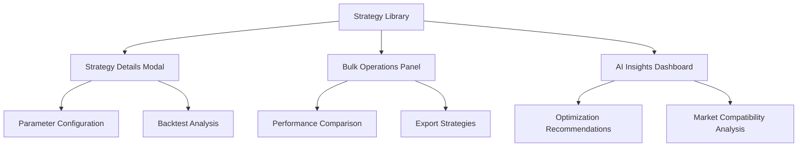

# Strategy Management Interface - Product Requirements Document

## 1. Product Overview
A comprehensive strategy management interface that enables traders to organize, analyze, and optimize their trading strategies through an intuitive card-based layout with advanced filtering, AI-powered insights, and bulk operations capabilities.

The interface serves as a central hub for strategy lifecycle management, from creation and testing to deployment and performance monitoring, helping traders make data-driven decisions about their trading approaches.

## 2. Core Features

### 2.1 User Roles
| Role | Registration Method | Core Permissions |
|------|---------------------|------------------|
| Individual Trader | Email registration | Can create, edit, and manage personal strategies |
| Strategy Creator | Premium upgrade | Can share strategies publicly and access advanced analytics |
| Strategy Consumer | Basic registration | Can browse, clone, and use shared strategies |

### 2.2 Feature Module
Our strategy management interface consists of the following main pages:
1. **Strategy Library**: card grid layout, search functionality, category filtering, favorites system
2. **Strategy Details Modal**: performance analytics, parameter configuration, backtest visualization, risk metrics
3. **Bulk Operations Panel**: multi-select interface, batch actions, performance comparison, export functionality
4. **AI Insights Dashboard**: strategy suggestions, optimization recommendations, market compatibility scoring

### 2.3 Page Details
| Page Name | Module Name | Feature description |
|-----------|-------------|---------------------|
| Strategy Library | Card Grid Layout | Display strategies in responsive grid with thumbnails, key metrics, and quick actions |
| Strategy Library | Search & Filter Bar | Real-time search by name/description, filter by status/performance/date, tag-based organization |
| Strategy Library | Quick Actions | Edit, clone, delete buttons with confirmation dialogs and loading states |
| Strategy Library | Favorites System | Star/unstar strategies, dedicated favorites view, persistent user preferences |
| Strategy Cards | Strategy Information | Display name, description, status indicator (Active/Inactive/Testing) with color coding |
| Strategy Cards | Performance Metrics | Show win rate, P&L, Sharpe ratio, last modified date with trend indicators |
| Strategy Cards | Creator Info | Display creator name, rating, shared strategy indicators for community strategies |
| Strategy Details Modal | Performance Analytics | Comprehensive charts showing equity curve, drawdown, monthly returns, win/loss distribution |
| Strategy Details Modal | Parameter Configuration | Interactive form for strategy parameters with validation and real-time preview |
| Strategy Details Modal | Backtest Results | Historical performance visualization with date range selection and benchmark comparison |
| Strategy Details Modal | Risk Metrics | Risk-adjusted returns, maximum drawdown, volatility metrics, correlation analysis |
| Strategy Details Modal | Strategy Rules | Human-readable explanation of strategy logic with visual flowchart representation |
| Bulk Operations Panel | Multi-Selection | Checkbox selection with select all/none, selection counter, and visual feedback |
| Bulk Operations Panel | Batch Actions | Activate/deactivate multiple strategies, bulk delete with confirmation modal |
| Bulk Operations Panel | Export Functionality | Export selected strategies to various formats (JSON, CSV) with custom field selection |
| Bulk Operations Panel | Performance Comparison | Side-by-side comparison view with key metrics and performance charts |
| AI Insights Dashboard | Strategy Suggestions | AI-recommended strategies based on current market conditions and user preferences |
| AI Insights Dashboard | Optimization Recommendations | Parameter optimization suggestions with expected performance improvements |
| AI Insights Dashboard | Market Compatibility | Scoring system for strategy performance in different market regimes |
| AI Insights Dashboard | Risk Assessment | Automated risk alerts and recommendations for portfolio diversification |

## 3. Core Process
**Individual Trader Flow:**
Users start at the Strategy Library where they can browse their personal strategies and community-shared ones. They can search and filter strategies based on various criteria, mark favorites, and perform quick actions. When they need detailed analysis, they open the Strategy Details Modal to view comprehensive analytics, configure parameters, and analyze backtest results. For managing multiple strategies, they use the Bulk Operations Panel to perform batch actions and compare performance. The AI Insights Dashboard provides ongoing recommendations for strategy optimization and market compatibility.

**Strategy Creator Flow:**
Creators follow a similar flow but have additional capabilities to share their strategies publicly, access advanced analytics, and receive feedback from the community. They can also monetize their strategies through the platform.

## 4. User Interface Design
### 4.1 Design Style
- **Primary Colors**: Deep blue (#1e40af) for primary actions, emerald green (#059669) for positive metrics
- **Secondary Colors**: Slate gray (#64748b) for secondary elements, red (#dc2626) for negative metrics and warnings
- **Button Style**: Rounded corners (8px radius) with subtle shadows and hover animations
- **Font**: Inter font family with 14px base size for body text, 16px for headings
- **Layout Style**: Card-based design with clean spacing, top navigation with breadcrumbs
- **Icons**: Lucide React icons with consistent 20px size, outline style for better clarity

### 4.2 Page Design Overview
| Page Name | Module Name | UI Elements |
|-----------|-------------|-------------|
| Strategy Library | Card Grid | Responsive 3-4 column grid, card hover effects, skeleton loading states, infinite scroll |
| Strategy Library | Search Bar | Prominent search input with autocomplete, filter chips, sort dropdown with custom options |
| Strategy Cards | Status Indicator | Color-coded badges (green=Active, yellow=Testing, gray=Inactive) with pulse animation |
| Strategy Cards | Metrics Display | Clean typography hierarchy, trend arrows, percentage changes with color coding |
| Strategy Details Modal | Analytics Charts | Interactive charts using Chart.js, responsive design, dark theme compatibility |
| Strategy Details Modal | Parameter Panel | Form inputs with validation, real-time preview, reset/save buttons with loading states |
| Bulk Operations Panel | Selection Interface | Checkbox styling, selection toolbar, action buttons with confirmation modals |
| AI Insights Dashboard | Recommendation Cards | Gradient backgrounds, confidence scores, action buttons with clear CTAs |

### 4.3 Responsiveness
Desktop-first approach with mobile-adaptive breakpoints at 768px and 1024px. Touch interaction optimization for mobile devices including swipe gestures for card actions, larger touch targets (44px minimum), and simplified navigation patterns. Tablet view uses 2-column grid layout while mobile uses single-column with collapsible filters.
