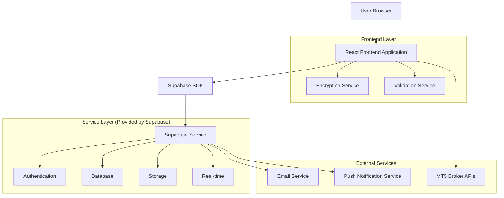
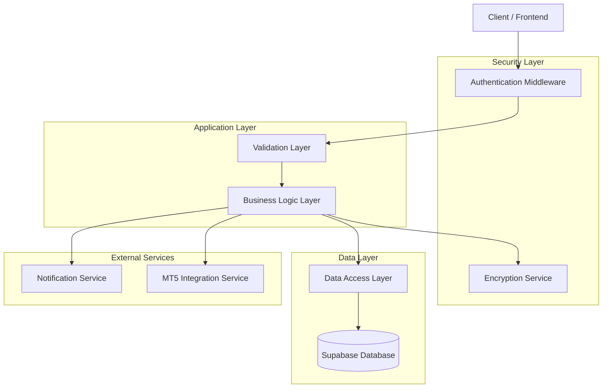
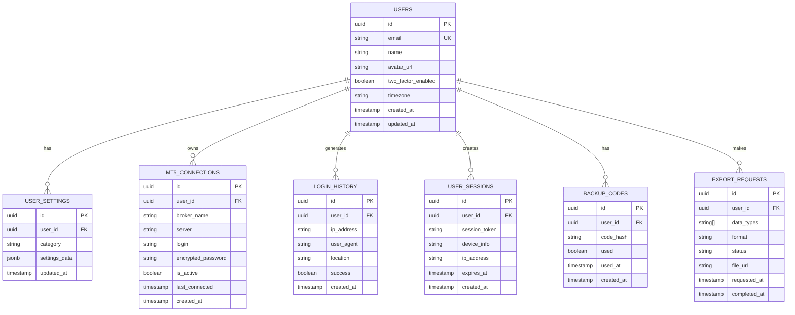

## 1. Architecture Design



## 2. Technology Description

* Frontend: React\@18 + TypeScript + Tailwind CSS + Vite + React Hook Form + Zod validation

* Backend: Supabase (Authentication, Database, Storage, Real-time subscriptions)

* Security: bcrypt for password hashing, AES-256 for sensitive data encryption, JWT for session management

* Validation: Zod schemas for form validation, server-side validation through Supabase RLS

* State Management: Zustand for global state, React Query for server state

* UI Components: Radix UI primitives, Lucide React icons

## 3. Route Definitions

| Route                   | Purpose                                                |
| ----------------------- | ------------------------------------------------------ |
| /settings               | Main settings dashboard with navigation sidebar        |
| /settings/account       | Account management including profile, password, 2FA    |
| /settings/mt5           | MT5 broker connection configuration and management     |
| /settings/trading       | Trading preferences and risk management settings       |
| /settings/ui            | UI customization including themes and layouts          |
| /settings/notifications | Notification preferences and alert settings            |
| /settings/security      | Security settings including login history and sessions |
| /settings/data          | Data management, backup, and GDPR compliance options   |

## 4. API Definitions

### 4.1 Core API

**User Profile Management**

```
PUT /api/user/profile
```

Request:

| Param Name  | Param Type | isRequired | Description          |
| ----------- | ---------- | ---------- | -------------------- |
| name        | string     | true       | User's display name  |
| email       | string     | true       | User's email address |
| avatar\_url | string     | false      | Profile picture URL  |
| timezone    | string     | false      | User's timezone      |

Response:

| Param Name | Param Type | Description          |
| ---------- | ---------- | -------------------- |
| success    | boolean    | Operation status     |
| user       | object     | Updated user profile |

**Password Change**

```
PUT /api/user/password
```

Request:

| Param Name        | Param Type | isRequired | Description                       |
| ----------------- | ---------- | ---------- | --------------------------------- |
| current\_password | string     | true       | Current password for verification |
| new\_password     | string     | true       | New password (hashed on client)   |

**Two-Factor Authentication**

```
POST /api/user/2fa/enable
```

Request:

| Param Name | Param Type | isRequired | Description            |
| ---------- | ---------- | ---------- | ---------------------- |
| totp\_code | string     | true       | TOTP verification code |

Response:

| Param Name    | Param Type | Description            |
| ------------- | ---------- | ---------------------- |
| backup\_codes | string\[]  | Recovery backup codes  |
| qr\_code      | string     | Base64 encoded QR code |

**MT5 Connection Management**

```
POST /api/mt5/connection
```

Request:

| Param Name   | Param Type | isRequired | Description                      |
| ------------ | ---------- | ---------- | -------------------------------- |
| broker\_name | string     | true       | Broker display name              |
| server       | string     | true       | MT5 server address               |
| login        | string     | true       | MT5 account login                |
| password     | string     | true       | MT5 account password (encrypted) |

**Connection Test**

```
POST /api/mt5/test-connection
```

Request:

| Param Name     | Param Type | isRequired | Description       |
| -------------- | ---------- | ---------- | ----------------- |
| connection\_id | string     | true       | MT5 connection ID |

Response:

| Param Name   | Param Type | Description                                  |
| ------------ | ---------- | -------------------------------------------- |
| status       | string     | Connection status (connected/failed/timeout) |
| latency      | number     | Connection latency in ms                     |
| server\_time | string     | Server timestamp                             |

**Settings Management**

```
PUT /api/user/settings
```

Request:

| Param Name | Param Type | isRequired | Description                                           |
| ---------- | ---------- | ---------- | ----------------------------------------------------- |
| category   | string     | true       | Settings category (trading/ui/notifications/security) |
| settings   | object     | true       | Category-specific settings object                     |

**Data Export**

```
POST /api/user/export
```

Request:

| Param Name  | Param Type | isRequired | Description                    |
| ----------- | ---------- | ---------- | ------------------------------ |
| data\_types | string\[]  | true       | Types of data to export        |
| format      | string     | true       | Export format (json/csv)       |
| date\_range | object     | false      | Date range for historical data |

## 5. Server Architecture Diagram



## 6. Data Model

### 6.1 Data Model Definition



### 6.2 Data Definition Language

**Users Table**

```sql
-- Create users table (extends Supabase auth.users)
CREATE TABLE public.user_profiles (
    id UUID PRIMARY KEY REFERENCES auth.users(id) ON DELETE CASCADE,
    email VARCHAR(255) NOT NULL,
    name VARCHAR(100),
    avatar_url TEXT,
    two_factor_enabled BOOLEAN DEFAULT FALSE,
    timezone VARCHAR(50) DEFAULT 'UTC',
    created_at TIMESTAMP WITH TIME ZONE DEFAULT NOW(),
    updated_at TIMESTAMP WITH TIME ZONE DEFAULT NOW()
);

-- Create RLS policies
ALTER TABLE public.user_profiles ENABLE ROW LEVEL SECURITY;
CREATE POLICY "Users can view own profile" ON public.user_profiles
    FOR SELECT USING (auth.uid() = id);
CREATE POLICY "Users can update own profile" ON public.user_profiles
    FOR UPDATE USING (auth.uid() = id);
```

**User Settings Table**

```sql
CREATE TABLE public.user_settings (
    id UUID PRIMARY KEY DEFAULT gen_random_uuid(),
    user_id UUID NOT NULL REFERENCES public.user_profiles(id) ON DELETE CASCADE,
    category VARCHAR(50) NOT NULL CHECK (category IN ('trading', 'ui', 'notifications', 'security', 'data')),
    settings_data JSONB NOT NULL DEFAULT '{}',
    updated_at TIMESTAMP WITH TIME ZONE DEFAULT NOW(),
    UNIQUE(user_id, category)
);

-- Create indexes
CREATE INDEX idx_user_settings_user_id ON public.user_settings(user_id);
CREATE INDEX idx_user_settings_category ON public.user_settings(category);

-- RLS policies
ALTER TABLE public.user_settings ENABLE ROW LEVEL SECURITY;
GRANT SELECT, INSERT, UPDATE, DELETE ON public.user_settings TO authenticated;
CREATE POLICY "Users can manage own settings" ON public.user_settings
    FOR ALL USING (auth.uid() = user_id);
```

**MT5 Connections Table**

```sql
CREATE TABLE public.mt5_connections (
    id UUID PRIMARY KEY DEFAULT gen_random_uuid(),
    user_id UUID NOT NULL REFERENCES public.user_profiles(id) ON DELETE CASCADE,
    broker_name VARCHAR(100) NOT NULL,
    server VARCHAR(100) NOT NULL,
    login VARCHAR(50) NOT NULL,
    encrypted_password TEXT NOT NULL,
    is_active BOOLEAN DEFAULT TRUE,
    last_connected TIMESTAMP WITH TIME ZONE,
    created_at TIMESTAMP WITH TIME ZONE DEFAULT NOW()
);

-- Create indexes
CREATE INDEX idx_mt5_connections_user_id ON public.mt5_connections(user_id);
CREATE INDEX idx_mt5_connections_active ON public.mt5_connections(user_id, is_active);

-- RLS policies
ALTER TABLE public.mt5_connections ENABLE ROW LEVEL SECURITY;
GRANT ALL PRIVILEGES ON public.mt5_connections TO authenticated;
CREATE POLICY "Users can manage own MT5 connections" ON public.mt5_connections
    FOR ALL USING (auth.uid() = user_id);
```

**Login History Table**

```sql
CREATE TABLE public.login_history (
    id UUID PRIMARY KEY DEFAULT gen_random_uuid(),
    user_id UUID NOT NULL REFERENCES public.user_profiles(id) ON DELETE CASCADE,
    ip_address INET,
    user_agent TEXT,
    location VARCHAR(100),
    success BOOLEAN NOT NULL,
    created_at TIMESTAMP WITH TIME ZONE DEFAULT NOW()
);

-- Create indexes
CREATE INDEX idx_login_history_user_id ON public.login_history(user_id);
CREATE INDEX idx_login_history_created_at ON public.login_history(created_at DESC);

-- RLS policies
ALTER TABLE public.login_history ENABLE ROW LEVEL SECURITY;
GRANT SELECT ON public.login_history TO authenticated;
CREATE POLICY "Users can view own login history" ON public.login_history
    FOR SELECT USING (auth.uid() = user_id);
```

**User Sessions Table**

```sql
CREATE TABLE public.user_sessions (
    id UUID PRIMARY KEY DEFAULT gen_random_uuid(),
    user_id UUID NOT NULL REFERENCES public.user_profiles(id) ON DELETE CASCADE,
    session_token VARCHAR(255) NOT NULL UNIQUE,
    device_info TEXT,
    ip_address INET,
    expires_at TIMESTAMP WITH TIME ZONE NOT NULL,
    created_at TIMESTAMP WITH TIME ZONE DEFAULT NOW()
);

-- Create indexes
CREATE INDEX idx_user_sessions_user_id ON public.user_sessions(user_id);
CREATE INDEX idx_user_sessions_token ON public.user_sessions(session_token);
CREATE INDEX idx_user_sessions_expires ON public.user_sessions(expires_at);

-- RLS policies
ALTER TABLE public.user_sessions ENABLE ROW LEVEL SECURITY;
GRANT ALL PRIVILEGES ON public.user_sessions TO authenticated;
CREATE POLICY "Users can manage own sessions" ON public.user_sessions
    FOR ALL USING (auth.uid() = user_id);
```

**Backup Codes Table**

```sql
CREATE TABLE public.backup_codes (
    id UUID PRIMARY KEY DEFAULT gen_random_uuid(),
    user_id UUID NOT NULL REFERENCES public.user_profiles(id) ON DELETE CASCADE,
    code_hash VARCHAR(255) NOT NULL,
    used BOOLEAN DEFAULT FALSE,
    used_at TIMESTAMP WITH TIME ZONE,
    created_at TIMESTAMP WITH TIME ZONE DEFAULT NOW()
);

-- Create indexes
CREATE INDEX idx_backup_codes_user_id ON public.backup_codes(user_id);
CREATE INDEX idx_backup_codes_hash ON public.backup_codes(code_hash);

-- RLS policies
ALTER TABLE public.backup_codes ENABLE ROW LEVEL SECURITY;
GRANT ALL PRIVILEGES ON public.backup_codes TO authenticated;
CREATE POLICY "Users can manage own backup codes" ON public.backup_codes
    FOR ALL USING (auth.uid() = user_id);
```

**Export Requests Table**

```sql
CREATE TABLE public.export_requests (
    id UUID PRIMARY KEY DEFAULT gen_random_uuid(),
    user_id UUID NOT NULL REFERENCES public.user_profiles(id) ON DELETE CASCADE,
    data_types TEXT[] NOT NULL,
    format VARCHAR(10) NOT NULL CHECK (format IN ('json', 'csv')),
    status VARCHAR(20) NOT NULL DEFAULT 'pending' CHECK (status IN ('pending', 'processing', 'completed', 'failed')),
    file_url TEXT,
    requested_at TIMESTAMP WITH TIME ZONE DEFAULT NOW(),
    completed_at TIMESTAMP WITH TIME ZONE
);

-- Create indexes
CREATE INDEX idx_export_requests_user_id ON public.export_requests(user_id);
CREATE INDEX idx_export_requests_status ON public.export_requests(status);
CREATE INDEX idx_export_requests_requested_at ON public.export_requests(requested_at DESC);

-- RLS policies
ALTER TABLE public.export_requests ENABLE ROW LEVEL SECURITY;
GRANT ALL PRIVILEGES ON public.export_requests TO authenticated;
CREATE POLICY "Users can manage own export requests" ON public.export_requests
    FOR ALL USING (auth.uid() = user_id);
```

**Initial Data**

```sql
-- Insert default settings for new users (handled by trigger)
CREATE OR REPLACE FUNCTION public.handle_new_user()
RETURNS TRIGGER AS $$
BEGIN
    INSERT INTO public.user_profiles (id, email, name)
    VALUES (NEW.id, NEW.email, NEW.raw_user_meta_data->>'name');
    
    -- Insert default settings
    INSERT INTO public.user_settings (user_id, category, settings_data) VALUES
    (NEW.id, 'trading', '{
        "default_lot_size": 0.1,
        "default_order_type": "market",
        "max_risk_per_trade": 2.0,
        "auto_close_enabled": false
    }'),
    (NEW.id, 'ui', '{
        "theme": "system",
        "language": "en",
        "font_size": "medium",
        "layout": "default"
    }'),
    (NEW.id, 'notifications', '{
        "email_enabled": true,
        "push_enabled": true,
        "sound_enabled": true,
        "frequency": "normal"
    }'),
    (NEW.id, 'security', '{
        "session_timeout": 3600,
        "login_notifications": true,
        "suspicious_activity_alerts": true
    }'),
    (NEW.id, 'data', '{
        "retention_period": 365,
        "auto_backup": false,
        "gdpr_consent": false
    }');
    
    RETURN NEW;
END;
$$ LANGUAGE plpgsql SECURITY DEFINER;

-- Create trigger for new user setup
CREATE TRIGGER on_auth_user_created
    AFTER INSERT ON auth.users
    FOR EACH ROW EXECUTE FUNCTION public.handle_new_user();
```

