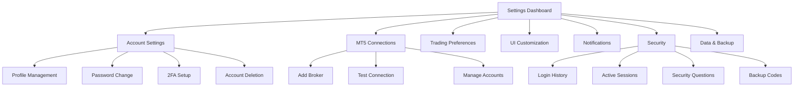

## 1. Product Overview
A comprehensive user settings and configuration system for the NusaNexus Trading platform that provides secure, intuitive management of account settings, trading preferences, MT5 connections, and system customization options.

The system addresses the need for traders to personalize their trading environment, manage multiple broker connections securely, and maintain control over their data and privacy settings while ensuring compliance with security best practices.

## 2. Core Features

### 2.1 User Roles
| Role | Registration Method | Core Permissions |
|------|---------------------|------------------|
| Registered User | Email/OAuth registration | Full access to personal settings, trading preferences, and account management |
| Premium User | Subscription upgrade | Additional features like advanced backup options, priority support, and enhanced security features |

### 2.2 Feature Module
Our user settings system consists of the following main sections:
1. **Account Settings**: profile management, password security, 2FA setup, account deletion, data export
2. **MT5 Connection Settings**: broker configuration, credential management, connection testing, multi-account support
3. **Trading Preferences**: order defaults, risk management, auto-close rules, session preferences
4. **UI Customization**: theme selection, layout preferences, color schemes, font options, language settings
5. **Notification Settings**: email/push toggles, alert customization, frequency controls, custom conditions
6. **Security Settings**: login history, session management, security questions, backup codes, privacy controls
7. **Data & Backup**: strategy export/import, history backup, settings sync, retention policies, GDPR compliance

### 2.3 Page Details
| Page Name | Module Name | Feature description |
|-----------|-------------|---------------------|
| Account Settings | Profile Management | Edit personal information (name, email, avatar), upload profile picture with validation |
| Account Settings | Password Security | Change password with current password verification, strength validation, confirmation matching |
| Account Settings | Two-Factor Authentication | Enable/disable 2FA, QR code generation, backup codes, recovery options |
| Account Settings | Account Deletion | Request account deletion with confirmation dialog, data retention notice, final verification |
| Account Settings | Data Export | Download personal data in JSON/CSV format, GDPR compliance, export history tracking |
| MT5 Connection | Broker Selection | Dropdown with popular brokers, custom server input, connection parameters validation |
| MT5 Connection | Credentials Management | Encrypted credential storage, masked display, credential testing, multiple account support |
| MT5 Connection | Connection Testing | Real-time connection validation, latency testing, server status monitoring |
| MT5 Connection | Account Management | Add/remove multiple accounts, account switching, connection status indicators |
| Trading Preferences | Order Defaults | Set default lot sizes, order types, stop loss/take profit levels, execution preferences |
| Trading Preferences | Risk Management | Maximum risk per trade, daily loss limits, position sizing rules, margin requirements |
| Trading Preferences | Auto-Close Rules | Time-based closures, profit targets, loss limits, weekend closure settings |
| Trading Preferences | Session Preferences | Trading hours, market session alerts, timezone settings, holiday schedules |
| UI Customization | Theme Selection | Dark/light mode toggle, custom theme creation, theme preview, system theme detection |
| UI Customization | Layout Preferences | Dashboard widget arrangement, panel sizing, workspace layouts, responsive settings |
| UI Customization | Color Schemes | Chart color customization, indicator colors, UI accent colors, accessibility options |
| UI Customization | Typography | Font family selection, size adjustment, weight options, readability settings |
| UI Customization | Language Settings | Multi-language support, regional formats, currency display, date/time formats |
| Notification Settings | Email Notifications | Toggle email alerts, frequency settings, digest options, unsubscribe management |
| Notification Settings | Push Notifications | Browser/mobile push settings, notification categories, quiet hours, priority levels |
| Notification Settings | Alert Customization | Custom sound selection, volume control, visual alerts, vibration patterns |
| Notification Settings | Frequency Controls | Rate limiting, batch notifications, smart grouping, spam prevention |
| Notification Settings | Custom Conditions | User-defined alert triggers, conditional logic, threshold settings, automation rules |
| Security Settings | Login History | Display recent logins, IP addresses, device information, suspicious activity alerts |
| Security Settings | Session Management | Active sessions list, remote logout, device management, session timeout settings |
| Security Settings | Security Questions | Setup/change security questions, answer validation, recovery process, question rotation |
| Security Settings | Backup Codes | Generate recovery codes, code usage tracking, regeneration options, secure storage tips |
| Security Settings | Privacy Controls | Data sharing preferences, analytics opt-out, cookie settings, third-party integrations |
| Data & Backup | Strategy Export | Export trading strategies in multiple formats, batch export, metadata inclusion |
| Data & Backup | Strategy Import | Import strategies with validation, conflict resolution, backup creation before import |
| Data & Backup | History Backup | Automated/manual backup of trading history, cloud storage integration, backup scheduling |
| Data & Backup | Settings Sync | Cross-device synchronization, conflict resolution, selective sync options |
| Data & Backup | Retention Policies | Data retention periods, automatic cleanup, compliance with regulations |
| Data & Backup | GDPR Compliance | Right to be forgotten, data portability, consent management, privacy policy acceptance |

## 3. Core Process

**User Settings Management Flow:**
Users access settings through the main navigation, navigate between different setting categories using a tabbed interface, make changes with real-time validation, and save changes with confirmation feedback. Critical changes like password updates or account deletion require additional verification steps.

**MT5 Connection Setup Flow:**
Users add new broker connections by selecting from a dropdown or entering custom server details, input credentials which are encrypted before storage, test the connection for validation, and manage multiple accounts with easy switching capabilities.

**Security Configuration Flow:**
Users enable two-factor authentication through QR code scanning, set up security questions for account recovery, generate and securely store backup codes, and monitor their account security through login history and active session management.

## 4. User Interface Design

### 4.1 Design Style
- **Primary Colors**: Blue (#2563eb) for primary actions, Gray (#64748b) for secondary elements
- **Secondary Colors**: Green (#10b981) for success states, Red (#ef4444) for warnings/errors, Yellow (#f59e0b) for cautions
- **Button Style**: Rounded corners (8px radius), subtle shadows, hover state animations
- **Typography**: Inter font family, 14px base size, 16px for headings, 12px for captions
- **Layout Style**: Card-based design with clean spacing, left sidebar navigation, responsive grid system
- **Icons**: Lucide React icons for consistency, 20px standard size, contextual colors

### 4.2 Page Design Overview
| Page Name | Module Name | UI Elements |
|-----------|-------------|-------------|
| Settings Dashboard | Navigation Sidebar | Vertical tab navigation with icons, active state highlighting, section grouping |
| Account Settings | Profile Form | Avatar upload with preview, form fields with validation states, save/cancel buttons |
| Account Settings | Password Form | Current password field, new password with strength meter, confirmation field, security tips |
| Account Settings | 2FA Setup | QR code display, backup codes list, toggle switches, setup wizard steps |
| MT5 Connection | Broker Selection | Searchable dropdown, custom server input, connection status indicators |
| MT5 Connection | Credentials Form | Masked password fields, test connection button, encryption status badge |
| Trading Preferences | Settings Grid | Organized sections with labels, input fields with units, range sliders, toggle switches |
| UI Customization | Theme Preview | Live preview panel, color picker components, font size slider, layout mockups |
| Notification Settings | Toggle Lists | Categorized notification types, frequency selectors, sound preview buttons |
| Security Settings | History Table | Login entries with timestamps, IP addresses, device info, action buttons |
| Data & Backup | Export Options | File format selection, date range picker, download progress, export history |

### 4.3 Responsiveness
Desktop-first responsive design with mobile-adaptive layouts. Touch-optimized controls for mobile devices, collapsible sidebar navigation on smaller screens, and optimized form layouts for various screen sizes. Minimum supported width: 320px for mobile compatibility.